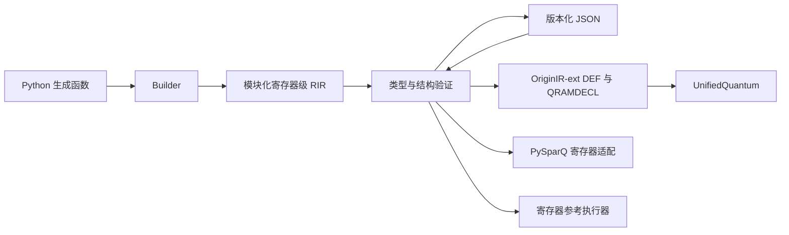

# 架构

Python 解释器执行生成函数。生成函数使用 Builder 构造不可变 Module，并返回携带依赖定义的 Operation。Operation.program 收集模块图、检查同名冲突并产生 Program。

## 生成阶段

Python 负责普通参数、函数、闭包和实现选择。普通 Builder 生成流程不解析 Python AST；新增 compile_function 入口专门读取受限的纯数学函数 AST，不引入新的文本语法。生成结束后，RIR 不包含 Python 可调用对象、包路径加载钩子或运行时经典分支。

模块已经完成具体形状实例化，但调用关系没有被展开。这两个过程必须区分：宽度具体化不意味着复制被调模块的主体。

## IR 层

RIR 0.3 的私有工作区见 [rir-spec.md](rir-spec.md)；0.2 的开放声明和绑定增量见 [open-ir.md](open-ir.md)。ir.py 定义不可变记录。validation.py 检查存储类型、寄存器视图、别名、控制位、资源参数、操作元数和调用图。serialization.py 提供严格的 JSON 往返。

模块参数全部是显式量子寄存器或 QRAM 资源。局部变量可以是 Python 中的视图引用，但不能在模块内隐式创造一个需要隐藏释放的量子寄存器。调用方分配并持有算法信号和工作区。

本版操作集都是固定 QRAM 数据下的酉操作，因此模块可以被控制和取逆。以后加入测量或其他效果时，必须扩展能力检查，不能沿用这一结论。

## 后端层

OriginIR 导出器直接消费 RIR，生成 DEF 定义及调用。它不会先创建 UnifiedQuantum Circuit，因为该对象及解析器会丢失模块和寄存器结构。

RIR 的 QRAM 是模块形式参数。OriginIR 的 QRAM 则使用全局名称。因此导出器按具体资源绑定特化 DEF，同一 RIR 模块绑定不同 QRAM 时，会生成不同的后端定义。相同绑定复用同一个定义。

Repeat 在 RIR 中保持一个节点。导出器使用二进制分解生成辅助 DEF，所需定义数量与重复次数的对数成比例。这种转换只发生在后端，JSON 中仍然保留 Repeat。

PySparQ 适配器将入口寄存器映射到原生的整数寄存器。它通过只读的按需事件遍历执行模块。QRAM 的切片和跨寄存器视图通过临时寄存器上的可逆 XOR 复制实现，随后完整反算；这些临时寄存器不改变原始 RIR。

## 验证层

核心测试只依赖标准库。参考模拟使用寄存器整数元组作为基态键，不使用扁平全局量子位作为内部状态键。

原生集成测试把相同 Program 分别送入参考模拟、PySparQ 和实际 OriginIR-ext 模拟器。测试比较复幅度，因此能够发现位序、相对相位、受控调用、伴随顺序和 QRAM 非零目标语义的错误。

这些验证不等同于大规模算法的数学正确性或资源优势证据。BE 库只维护实际构造的角块和归一化关系。

## 第二阶段后端路径

NativeRegistry 可以在模块边界截获 PySparQ 执行，执行器不会分配该模块内部的 locals 或遍历其算术主体。默认门级主体与注册表相互独立，native-only 不影响门级闭合判断。Boolean 算术合成同时保留模块化门实现和原生求值实现。严格目标门集 pass 在 DEF 内降低到 Toffoli/U3/CZ，QRAM 为独立资源指令。完整接口、具体算法边界与证据见 [第二阶段说明](stage2-implementation.md)。

## 纯数学函数前端

Python 纯函数经 MIR 0.1 转换到既有 RIR 0.3。MIR 保存类型、SSA 节点和 helper 调用，生成配置决定定点格式与数学核近似；helper 调用和量子模块边界保留。自动 lowering 负责输出 XOR 与私有工作区反算。完整使用方式见 [纯函数编译](function-compiler.md)，对象契约见 [MIR 规范](math-ir-spec.md)。
