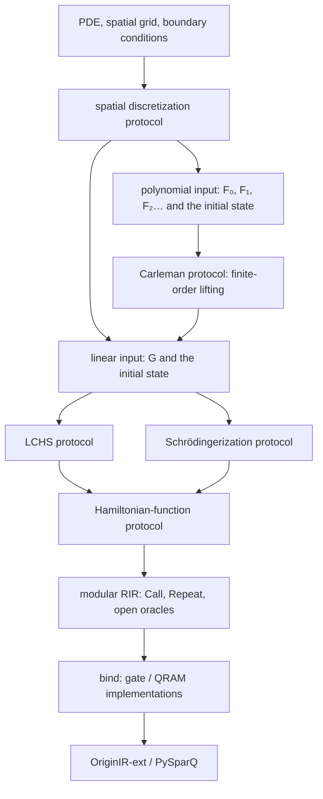

# Implementing QPDE/QODE: multiple input paradigms, replaceable oracles, and protocols

**English** · <a href="../zh/manual/differential-equations.html">简体中文</a>

This chapter covers input adaptation and algorithm assembly for QPDE/QODE. For input conventions see [the conventions owned by algorithms](contracts.md): input objects can satisfy multiple Python protocols at once, and algorithms do not rely on exclusive global type labels. The goal is to let you write your own PDE discretization, swap input oracles, and then choose <a href="../zh/manual/algorithms/lchs.html">LCHS</a>, <a href="../zh/manual/algorithms/schrodingerization.html">Schrödingerization</a>, or <a href="../zh/manual/algorithms/carleman.html">Carleman</a> to compose a program. For an introductory tutorial see [swapping QODE methods for the same linear problem](../tutorials/differential-equations.md); the complete runnable file is [examples/ode_input_models.py](../../examples/ode_input_models.py); the local snippets in this page explain the interfaces, while the full script contains imports, data, bindings, and exports.

The design recommendation: **the problem layer keeps the original input paradigm, adapters explicitly construct the inputs the algorithm needs, and protocols generate new oracles in Python; the RIR stores the generated modules and the not-yet-implemented oracles.** Do not force one primitive input onto every algorithm, and do not treat any two input models as freely interchangeable.

The following sections describe the existing interfaces, the host adaptation functions, and the implementations still to be provided. A structure being assemblable does not mean the paper's error, success-probability, or complexity conclusions already hold.

## 1. Division of labor from PDE to circuit



LCHS and Schrödingerization are two implementation routes for linear evolution. Carleman lifts a polynomial-nonlinear ODE into a linear ODE, so it is usually composed as `Carleman → LCHS` or `Carleman → Schrödingerization` and does not sit in the same replacement slot as the latter two.

QPDE adds a spatial input-construction layer on top of QODE. It handles grid numbering, component layout, boundary conditions, discrete derivatives, coefficients, initial values, and forcing terms; QODE receives the finite-dimensional operator these constructions produce. The grid number living in a quantum address register is not the unknown field value living in an amplitude: the amplitude `u_j` cannot be fed directly as a numeric input register of {obj}`compile_function <oracq.infrastructure.mathfunc.compile_function>`.

## 2. Three kinds of objects, three replacement slots

| Object | Code form | How to replace |
|---|---|---|
| Oracle paradigm | {obj}`BlockEncoding <oracq.algorithms.input_model.operators.BlockEncoding>`, {obj}`SparseAccess <oracq.algorithms.input_model.oracles.SparseAccess>`, {obj}`XorDatabase <oracq.algorithms.input_model.oracles.XorDatabase>`, {obj}`StatePreparation <oracq.algorithms.input_model.oracles.StatePreparation>` | mathematical interface and register conventions; adapters are needed between paradigms |
| Oracle implementation | an {obj}`Operation <oracq.infrastructure.builder.Operation>`, with a gate/QRAM body or `body=None` | use {obj}`bind <oracq.infrastructure.linking.bind>` when the signature and assembly constants match |
| Protocol | a Python function, `partial`, closure, or callable object | swap the function, then regenerate the higher-level algorithm |

For example, {obj}`linear_qode("lchs", ...) <oracq.algorithms.qode.ode.linear_qode>` is a protocol, and the {obj}`StateOracle <oracq.algorithms.input_model.oracles.StateOracle>` returned by `solver(G, initial, T)` is one concrete algorithm operation. Its internal `G` may not be implemented yet. What is unfinished is the operation body; register widths, the BE's alpha, and invocation capabilities must already be fixed.

The currently available interfaces are:

| Entry | Inputs and outputs | Where it applies |
|---|---|---|
| `linear_qode(method, **config)` | returns `(G, initial, time) -> StateOracle` | for `u'=Gu`; method is `lchs` / `schrodingerization` / `cbmd` |
| {obj}`lchs_qode(model, time, ...) <oracq.algorithms.qode.lchs.lchs_qode>` | {obj}`LinearODE(HermitianParts(L,H), initial) <oracq.algorithms.qode.ode_models.LinearODE>` | for `u'=-(L+iH)u` |
| {obj}`schrodinger_qode(G, initial, time, ...) <oracq.algorithms.qode.schrodingerization.schrodinger_qode>` | BE, state preparation → output state oracle | for `u'=Gu` |
| {obj}`carleman_qode(problem, time, linear_solver, cutoff=...) <oracq.algorithms.qnlss.carleman.carleman_qode>` | {obj}`PolynomialODE <oracq.algorithms.qnlss.carleman.PolynomialODE>` → output state oracle | injects one of the above three-argument linear protocols |
| `hamiltonian_function(K, time)` | `BlockEncoding -> BlockEncoding` | returns a concrete approximate encoding of `exp(-iKt)` |
| {obj}`make_qpde(qode, discretizer=...) <oracq.algorithms.qpde.pde.make_qpde>` | `(problem, time) -> StateOracle` | the discretizer returns an object with `.generator/.initial`, such as {obj}`DiscretePDE <oracq.algorithms.qpde.pde.DiscretePDE>` |
| {obj}`qpde_solver(qode, spatial_discretizer=...) <oracq.algorithms.qpde.pde.qpde_solver>` | `(problem, time) -> StateOracle` | the discretizer returns a single model, then calls `qode(model,time)`; suited to `PolynomialODE` |

The two QPDE factories follow different calling conventions. Both live in [pde.py](../api/algorithms/qpde/pde.rst); the generic linear solving entry is in [ode.py](../api/algorithms/qode/ode.rst), and the concrete methods in the corresponding algorithm files. Do not pass the three-argument `linear_qode(...)` directly to the default `qpde_solver`.

You may declare static types in your own application with Python's `typing.Protocol`, but it is not a new IR node, nor does it automatically prove algorithmic premises:

```python
from typing import Protocol
from oracq import BlockEncoding
from oracq.algorithms.input_model.oracles import StateOracle, StatePreparation

class LinearSolver(Protocol):
    def __call__(self, generator: BlockEncoding,
                 initial: StatePreparation, time: float) -> StateOracle: ...

class HamiltonianFunction(Protocol):
    def __call__(self, hamiltonian: BlockEncoding,
                 time: float) -> BlockEncoding: ...
```

`LinearSolver` here only illustrates the calling form. In the library, {obj}`QODEProtocol <oracq.algorithms.qode.ode.QODEProtocol>` provides contract/check and {obj}`QODEProblem <oracq.algorithms.qode.ode.QODEProblem>` provides the problem entry. The existing QLSS `LinearSystem/QLSSProtocol/SolveResult` is a separate interface; QODE input adaptation is decided by each algorithm's protocol, and a complete norm-recovery object is still not provided.

## 3. Which input paradigms a given oracle should allow

Applications are advised to keep track of "which access capabilities they own" and then choose adaptations explicitly. The existing building blocks support the following inputs:

| Given input | What you must provide | Path and boundary into QODE |
|---|---|---|
| Whole-operator BE | `target:n`, `signal:a`, `alpha`, matrix interpretation, adjoint/controlled capabilities | hand directly to `linear_qode`; construct Hermitian parts from `G/G†` when needed |
| Hermitian parts given separately | BEs of `L,H`, `A=L+iH`, and an `L>=0` declaration | hand directly to `lchs_qode`; avoid merging first and splitting later |
| CKS sparse position + entry | in-place position permutation, numeric XOR at arbitrary rows/columns, sparsity, value format, entry bound | use a sparse→BE construction that satisfies the premises; the current ordinary adaptation only covers real symmetric with non-negative diagonal |
| XOR database | the reversible query `|j,z>→|j,z XOR d_j>`, with a clear meaning of the data word | a diagonal angle table can use {obj}`diagonal_block_encoding <oracq.algorithms.input_model.oracles.diagonal_block_encoding>`; general matrices additionally need position/preparation/numeric-to-amplitude adaptation |
| Reversible numeric-computation oracle | addresses/physical parameters preserved, outputs the matrix-element value word, with a status bit | build the entry oracle together with the spatial structure, then attach numeric-to-amplitude conversion; `compile_function` can generate the computation module |
| Structured operator | shifts, projections, Pauli terms, derivatives, diagonal coefficients, tensor/component selection | construct the BE directly with `lcu/product/tensor` without materializing the matrix |
| Multilinear coefficient port | the rectangular padded BE of `F_p: C^(d^p)→C^d` | build a `PolynomialODE` and go through Carleman; the nonlinear map itself is not treated as a unitary |
| Initial-state preparation | `target:n`, `work:w`, a normalized vector from the zero state, clean work | a standalone `StatePreparation`; the raw vector norm is stored separately |

### 3.1 Providing a BE or parts directly

The BE convention is

$$
(\langle0^a|\otimes I)U_G(|0^a\rangle\otimes I)=\widetilde G/\alpha_G.
$$

Here `U_G` is the actual circuit and `G̃` is the matrix encoded by that circuit; the distance to the target `G` is not guaranteed by the language. `alpha_G` participates in subsequent composition — you cannot "optimize the normalization" by merely editing an attribute.

```python
from functools import partial
from oracq.algorithms.qode.ode import linear_qode
from oracq.algorithms.common.hamiltonian import taylor_hamiltonian
from oracq.algorithms.input_model.oracles import abstract_block_encoding, abstract_state_prep

G = abstract_block_encoding("Generator", width=2, signal_width=3, alpha=4.0)
initial = abstract_state_prep("Initial", width=2, work_width=0)
solver = linear_qode("schrodingerization",
                    hamiltonian_function=partial(taylor_hamiltonian, degree=1))
state = solver(G, initial, 0.05)
program = state.operation.program()  # valid: open RIR still containing Generator/Initial
```

If you are given `A=L+iH`, you can construct `LinearODE(HermitianParts(L,H),initial)` directly. `HermitianParts.hermitian` stores `L` and the field `.h` stores `H`; both should be Hermitian — the type itself only checks widths. For Schrödingerization, the existing entry requires `G`, which you can construct explicitly with {obj}`lcu([(-1,L),(-1j,H)]) <oracq.algorithms.input_model.block_encoding.lcu>`. There is currently no optimized Schrödingerization entry that consumes parts directly.

### 3.2 An XOR database is not amplitude access

`diagonal_block_encoding(db, alpha=α, angle_scale=s)` actually encodes

$$
D_{jj}=\alpha\cos(s\,d_j/2).
$$

It first queries the angle word, applies a controlled `Ry`, then un-queries to clean the value word. If the target is a real diagonal coefficient `c_j`, you must supply an angle table encoding `2 arccos(c_j/α)`, or generate that angle with reversible computation. **You cannot pass a fixed-point table storing `c_j` as is and claim to have obtained `diag(c_j)`.** Angle quantization changes the actually encoded matrix.

The tutorial uses 2-bit angle words, the default `s=2π/4`, and the table `[0,1]`, obtaining `A=diag(1,cos(π/4))`, then feeds `G=-A` into LCHS. The same open database can be bound to a gate table or to a QRAM:

```python
from oracq import Binding, bind
from oracq.algorithms.input_model.oracles import abstract_database, diagonal_block_encoding, qram_database

angles = abstract_database("DiagonalAngles", 1, 2)
A = diagonal_block_encoding(angles, alpha=1.0)
closed_A = bind(A.operation.program(), {
    "DiagonalAngles": Binding(qram_database(1, 2).operation,
                              {"table": "diagonal_angles"}),
})
memory = {"diagonal_angles": [0, 1]}
```

Table contents are runtime inputs, kept separate from the resource declarations in the IR. A QRAM can replace the data-storage implementation, but it does not automatically provide efficient amplitude loading, row-state preparation, or a block encoding of the matrix.

### 3.3 Sparse position and matrix elements stay separately open

```python
from oracq import FixedFormat
from oracq.algorithms.input_model.oracles import abstract_sparse_access
from oracq.algorithms.input_model.sparse import real_symmetric_sparse_encoding

fmt = FixedFormat(4, 1)
access = abstract_sparse_access("SparseA", width=1, value_width=4, sparsity=2)
A = real_symmetric_sparse_encoding(access, fmt, amax=1.0,
                                   diagonal_nonnegative=True)
```

What remains unfinished here are `SparseA_position` and `SparseA_entry`; the remaining sparse preparation and BE modules have already been generated. The current position interface has the contract "`column` preserved, `index` permuted in place, `work` cleaned"; the first `s` slots cover the non-zero positions of the column. An XOR position table cannot directly replace a full permutation. The ordinary QRAM implementation realizes this interface with a forward and an inverse table.

The entry interface preserves `row,column` and XORs the {obj}`FixedFormat <oracq.algorithms.common.arithmetic.FixedFormat>`-encoded value into `data`; it must be defined for arbitrary row/column inputs, including zero elements. When wrapped by {obj}`sparse_entry(db,n) <oracq.algorithms.input_model.oracles.sparse_entry>`, the database address is `row + (column << n)`. The example matrix `[[1,-0.5],[-0.5,1]]` has spectrum `{0.5,1.5}`, satisfying both the current sparse adaptation and the LCHS premises, with `alpha_A=s*amax=2`.

The current sparse→BE construction is `T†ST`, involving an amplitude conversion of `sqrt(abs(value)/amax)` and a sign phase. When the value word exceeds 12 bits, the default conversion module stays open; an implementation can be injected with the `rotation=` parameter. `diagonal_nonnegative=True` is a caller declaration, not a proof of symmetry, boundedness, or positive semidefiniteness. A non-negative diagonal does not imply that the matrix is positive semidefinite.

General complex/non-symmetric sparse matrices need a separate adaptation. In particular, you cannot adapt to QODE by simply replacing `G` with `[[0,G],[G†,0]]` and evolving: the exponential of the latter does not automatically have a physical output block equal to `exp(tG)`. The Hermitian dilation trick of QLSS is not the dynamical transformation of QODE. For the related input distinctions see the [QFVM/QLSS review](qfvm.md).

### 3.4 The initial state has its own input paradigm too

{obj}`gate_state_prep(values) <oracq.algorithms.input_model.oracles.gate_state_prep>` gives a gate implementation with a full unitary extension, normalized automatically; {obj}`qram_state_prep(n,b) <oracq.algorithms.input_model.oracles.qram_state_prep>` queries a dedicated preparation angle table whose work width is `max(1,n)+b`; the angle table can be built by {obj}`qram_state_angles(values,b) <oracq.algorithms.input_model.oracles.qram_state_angles>`. The current QRAM helpers accept only non-negative real amplitudes; signed or complex phases require a separate implementation — this does not mean such a database preparation already exists. Its `angles` resource is not a table of raw amplitude values.

An open initial-state slot should state explicitly whether inverse/controlled forms are needed; if LCU, reflection, or controlled tensor preparations are used, those capabilities must be present. Carleman must additionally receive the raw `initial_norm`. Preparing tensor powers repeatedly means calling the initial-state oracle multiple times under a consistent coherent-phase convention; it is not copying an unknown quantum state.

## 4. LCHS: from inputs to the full generating function

First fix notation: the generic interface describes `u'=Gu`; the original LCHS interface describes `u'=-Au`. The two align via `A=-G`. Write

$$
A=L+iH,\qquad L=(A+A^\dagger)/2,\quad H=(A-A^\dagger)/(2i).
$$

In the autonomous case with `L>=0`, LCHS uses

$$
e^{-At}=\int_{\mathbb R}\frac{e^{-it(H+kL)}}{\pi(1+k^2)}\,dk.
$$

`H` and `L` are not required to commute. The construction follows [Theorem 1 of the original LCHS paper](https://arxiv.org/html/2303.01029v2). This library currently implements only the autonomous homogeneous interface; the time-dependent and inhomogeneous results of the paper do not automatically become capabilities of this library.

Spelled out as generation steps:

1. Choose nodes `k_j` and complex weights `w_j` that already include the integration kernel.
2. Generate the BE of `K_j=H+k_j L` with `alpha_Kj=alpha_H+|k_j|alpha_L` (zero-coefficient terms dropped).
3. Call the replaceable `hamiltonian_function(K_j,t)` to obtain the BE of the approximate evolution `E_j`, keeping its `alpha_Ej`.
4. Build the finite sum `Ṽ=Σw_j E_j` with `lcu([(w_j,E_j),...])`.
5. Call the initial-state preparation first, then `Ṽ`. The returned `StateOracle(target,signal)` has as its success subspace all signals being zero.

The core assembly itself is short; below is a combination of existing APIs that custom protocols can adopt:

```python
from oracq.algorithms.input_model.block_encoding import lcu
from oracq.algorithms.common.state_preparation import apply_be_to_state

def assemble_lchs(model, time, plan, hamiltonian_function):
    terms = []
    for node, weight in zip(plan.nodes, plan.weights, strict=True):
        K = lcu([(1, model.parts.h), (node, model.parts.hermitian)])
        E = hamiltonian_function(K, time)  # must be a BE and still follow the exp(-i K time) convention
        terms.append((weight, E))
    evolution = lcu(terms)
    return apply_be_to_state(evolution, model.initial)
```

The formal entry `lchs_qode` additionally records metadata such as nodes, the kernel, and evolution alphas. `QuadraturePlan.cauchy(cutoff=J,spacing=h)` generates `k=-Jh,...,Jh` and `w=h/[π(1+k²)]`. This is a finite-sum candidate with no tail-integration guarantee; do not forcibly normalize the weights and still call it the same approximation operator.

{obj}`taylor_hamiltonian(K,t,degree=r) <oracq.algorithms.common.hamiltonian.taylor_hamiltonian>` currently returns

$$
\widetilde E=\sum_{\ell=0}^r\frac{(-it)^\ell}{\ell!}K^\ell,
\quad\alpha_E=\sum_{\ell=0}^r\frac{|t|^\ell\alpha_K^\ell}{\ell!}.
$$

It is a BE of a non-unitary polynomial; it is not an exact HamSim acting directly on the target. The LCU correctly uses `Σ|w_j|alpha_Ej` as the normalization constant of the evolution. The `degree`, the nodes, and any future `eps` in the generation configuration are all host parameters.

### Replacing the internal protocol

```python
from functools import partial
from oracq.algorithms.qode.lchs import QuadraturePlan
from oracq.algorithms.qode.ode import linear_qode
from oracq.algorithms.common.hamiltonian import taylor_hamiltonian

config = QuadraturePlan.cauchy(cutoff=1, spacing=1.0)
solver1 = linear_qode("lchs", plan=config,
                     hamiltonian_function=partial(taylor_hamiltonian, degree=1))
solver2 = linear_qode("lchs", plan=config,
                     hamiltonian_function=partial(taylor_hamiltonian, degree=2))
```

This is a configuration swap within one protocol implementation. To swap in a different algorithm, just write a new `(K,t)->BlockEncoding` function, but it must handle the `K` input model actually passed in and honor the evolution direction, alpha, signal, controlled/adjoint, and uncomputation contracts. The library has no general QSP-HamSim implementation that can be enabled by a single name.

If you already have a Trotter implementation that only accepts Pauli lists, it cannot automatically recover a Pauli decomposition from an arbitrary black-box BE. Keep that structure at a higher level and write an explicit adapter or another solver generator. The `make_lchs_qode(ham_sim,times,weights)` kept in `algorithms/legacy.py` is only an LCU frame with caller-supplied decompositions; it does not construct a general `H+kL`. New algorithms should use the entries in this page.

## 5. Schrödingerization: the auxiliary coordinate also stays in registers

For `u'=Gu` define `G=H₁+iH₂`. Introduce the auxiliary variable `p`; inside the valid recovery region use `v(t,p)=exp(-p)u(t)`, extending the initial value to both sides as `v(0,p)=exp(-|p|)u₀`. The lifted equation is

$$
\partial_t v=-H_1\partial_p v+iH_2v.
$$

After Fourier transformation it becomes Hermitian Hamiltonian evolution. The tensor order in this implementation places the auxiliary coordinate in the high bits and the original physical coordinate in the low bits, corresponding to

$$
K=P\otimes H_1-I\otimes H_2.
$$

The construction follows [§3.1 of the Schrödingerization technical paper](https://arxiv.org/html/2212.14703v1). Tensor-order differences must be handled through the register layout; a different matrix vectorization order cannot be copied over directly.

The existing generator proceeds step by step:

1. Obtain `H₁,H₂` from `G/G†`.
2. Construct the frequency-diagonal operator `P` with the bitwise projection LCU of {obj}`fourier_momentum <oracq.algorithms.qode.schrodingerization.fourier_momentum>`, then the BE of `K`.
3. Call the original initial state on `target[:n]`, prepare the normalized `exp(-|p_j|)` on `target[n:]`, and apply the QFT to the auxiliary register.
4. Call the same `hamiltonian_function(K,t)` protocol.
5. Apply the inverse QFT to the auxiliary register, select one `p` channel, and fold that channel selection into the returned signal.

```python
from functools import partial
from oracq.algorithms.qode.schrodingerization import SchrodingerPlan
from oracq.algorithms.qode.ode import linear_qode
from oracq.algorithms.common.hamiltonian import taylor_hamiltonian

solver = linear_qode(
    "schrodingerization",
    plan=SchrodingerPlan(auxiliary_width=2, period=8.0, selected_index=1),
    hamiltonian_function=partial(taylor_hamiltonian, degree=1),
)
# solution = solver(G, initial, 0.05)
```

Under this configuration the auxiliary grid, in encoding order, is `[0,2,-4,-2]`, and the selected channel is `p=2`. The current implementation does not automatically verify that this point lies in the recovery region, nor that the periodic window is large enough; in general the window and channel must be chosen from the propagation speed of the Hermitian parts, the time, and the periodic boundary — `p>0` alone is not a sufficient condition for every problem. Full numerical validation of the Fourier sign, the finite grid, and the recovery region is still pending.

**Recovering amplitudes requires keeping the full scale.** Let the initial-state vector norm be `r`, the norm of the discrete warp vector be `Z=√Σ_j exp(-2|p_j|)`, and the alpha of the evolution BE be `α_E`. When the ideal recovery relation holds, the selected success block is approximately

$$
|\psi_{\rm good}\rangle
\approx\frac{e^{-p_j}}{rZ\alpha_E}|u(t)\rangle.
$$

The source's `recovery_scale=exp(p_j)` records only one factor of the warp; **it is not a complete norm-recovery interface**. The current `schrodinger_qode` returns a `StateOracle` and does not uniformly return a readout plan for `r,Z,alpha_E`. If your application needs physical amplitudes, keep these quantities in host configuration/result objects and do the probability estimation separately. The examples in this page validate assembly and export; they do not conflate the post-selected direction with a complete classical PDE solution array.

The historical entry `make_schrodingerisation_qode(embedding,ham_sim,...)` in `algorithms/legacy.py` leaves the embedding to the caller and does not automatically perform the warped initial state/QFT described here; the new implementation lives in `schrodingerization.py`.

## 6. Carleman: writing nonlinearity as multilinear input ports

First express the spatially discretized equation as

$$
u'=\sum_{p=0}^D F_pu^{\otimes p},\qquad u^{\otimes0}=1.
$$

Here `F₀` is a constant vector, `F₁` a linear operator, and `F₂` a linear tensor contraction from two inputs to one output. `F₂(u⊗u)` is nonlinear in `u`, but `F₂` is linear in the whole tensor input and can therefore be the object of a BE.

Letting `y_k=u^⊗k`, the product rule gives

$$
y_k'=\sum_{p=0}^D\sum_{j=0}^{k-1}
(I^{\otimes j}\otimes F_p\otimes I^{\otimes(k-j-1)})y_{k+p-1}.
$$

The finite truncation `K` keeps `y₀,...,y_K` and drops terms sourced from orders above `K`, yielding the linear generator `G_K`. This finite matrix construction is deterministic; how well it approximates the original nonlinear equation depends on the truncation and the applicability conditions. The convergence/efficiency basis of the quantum algorithm is found in the [Carleman paper](https://arxiv.org/abs/2011.03185v4) and cannot be derived from "a finite matrix can be generated". The v4 of that paper already contains the published corrections; this page does not carry over unverified old error bounds.

### 6.1 Register contract of F_p

If the raw vector dimension is `d=2^n`:

| Port | BE target width | Effective matrix in the zero-signal block |
|---|---|---|
| `F₀` | `n` | the first column is the forcing vector, the other columns zero |
| `F₁` | `n` | `d×d` |
| `F_p, p>=2` | `p*n` | the first `d` rows form the `d×d^p` tensor contraction; all remaining rows are strictly zero |

Input tensor factor 0 occupies the lowest `n` bits. The `F_p` output stays in the lowest `n` bits; the remaining target bits are zero in the success block. Each port has its own alpha and signal width. The code checks target widths but **does not prove rectangular zero padding or numeric semantics**.

The current Carleman layout is a fixed-size data region `target[:K*n]` plus a high-bit `level` whose width is `K.bit_length()`, carrying orders `0..K`. The valid data of order `k` occupies only the first `k*n` bits; the rest is zero. It uses a padded layout, not the compact `1+d+...+d^K` addressing; this resource difference should be kept in reports.

### 6.2 Obtaining these ports from an ordinary PDE

Take the periodic Burgers equation as an example:

$$
u_t=0.1u_{xx}-u u_x.
$$

After central differencing, `F₁=0.1D₂`. If the low-bit factor 0 corresponds to `u` and the high-bit factor 1 to `u_x`, then `F₂[j,i₀+d*i₁]=-δ[j,i₀]D₁[j,i₁]`, i.e. `F₂=-C(D₁⊗I)`, where the same-point contraction `C` keeps only the components whose two input coordinates coincide. The existing structured implementation generates these modules from shift LCUs, coordinate XOR, conditional flags, and coefficient multipliers.

```python
from oracq.applications.qham import Discretization, Field, Grid, PolynomialPDE, structured_fd_bindings

u = Field("u")
pde = PolynomialPDE.from_equations({"u": 0.1*u.d("x", 2) - u*u.d("x")})
grid = Grid(("x",), (4,), (1.0,), boundary="periodic")
space = Discretization(pde, grid)
initial_values = space.encode_fields({"u": [0.1, 0.2, 0, -0.1]})
ports = structured_fd_bindings(space, initial_values)
```

This step borrows the existing PDE/discretization and port generators from the `qham` package and **does not run the HAM recursion**. At this point the BEs of equal degree can be summed and turned into a `PolynomialODE`. The host function in the full script is:

```python
from collections import defaultdict
from oracq.algorithms.input_model.block_encoding import lcu
from oracq.algorithms.qnlss.carleman import PolynomialODE

def polynomial_from_bindings(bindings):
    grouped = defaultdict(list)
    for _, port in bindings.ports:
        grouped[port.arity].append((1, port.encoding))
    return PolynomialODE(
        bindings.state_width,
        tuple((p, lcu(terms)) for p, terms in sorted(grouped.items())),
        bindings.initial,
        bindings.initial_norm,
    )
```

This function lives in the example file; it is not a new core API. Do not guess that port names such as `B_1/B_2` are the polynomial degree — group by `PortBinding.arity`. You can also skip the PDE frontend entirely and provide open `F_p` BEs or ports constructed from QRAM/arithmetic.

```python
from functools import partial
from oracq.algorithms.qpde.pde import PDEInput, qpde_solver
from oracq.algorithms.qnlss.carleman import carleman_qode
from oracq.algorithms.qode.ode import linear_qode
from oracq.algorithms.common.hamiltonian import taylor_hamiltonian

problem = polynomial_from_bindings(ports)  # ports come from the Burgers discretization above
linear_solver = linear_qode("schrodingerization",
                           hamiltonian_function=partial(taylor_hamiltonian, degree=1))
nonlinear_solver = partial(carleman_qode, linear_solver=linear_solver, cutoff=2)
qpde = qpde_solver(nonlinear_solver)
solution = qpde(PDEInput(problem, "burgers"), 0.05)
```

The current structured finite-difference bindings require power-of-two axis lengths and periodic boundaries; variable coefficients have a known gate-table size cap, 4096 words by default. Other boundaries, data structures, and coefficient oracles can be provided by writing your own port implementations — the fact that {obj}`Grid <oracq.applications.qham.reference.Grid>` supports some classical boundary must not be read as the quantum lowering covering that boundary.

### 6.3 Initial state, output, and swapping the linear solver

The normalized lifted vector prepared by {obj}`carleman_initial <oracq.algorithms.qnlss.carleman.carleman_initial>` is

$$
\frac{(1,u_0,u_0^{\otimes2},...,u_0^{\otimes K})}
{\sqrt{\sum_{k=0}^K\|u_0\|^{2k}}}.
$$

So `initial_norm` determines the relative amplitudes of each order; it is not an omittable decorative attribute. The code calls the initial-state oracle multiple times; the currently public work reserves `K*initial.work_width`. `carleman_qode` finally selects level 1, requires the remaining data bits to be zero, and folds the selection condition into the signal.

The lifted `G_K` is not guaranteed to be dissipative, even if the original PDE or `F₁` may be. Therefore:

- Connecting Schrödingerization: pass `G_K` directly, then judge the auxiliary recovery region and finite-grid conditions separately.
- Connecting LCHS: you must confirm `Hermitian(-G_K)>=0`, or transform explicitly.

One conservative transformation chooses `μ>=alpha_GK` and sets `z'= (G_K-μI)z`, so that `y(t)=exp(μt)z(t)`. As long as the BE's matrix contract holds, `μ` is an upper bound sufficient to guarantee dissipation of the shift. **The shift must act on the whole lifted system, including level 0**; otherwise it is not a uniform amplitude rescaling.

The `shifted_solver` in the full script is exactly such a three-argument protocol wrapper: it generates `lcu([(1,G_K),(-μ,I)])`, calls LCHS, and stores `growth_shift` and `log_amplitude_rescale=μt` in the host report. It does not pretend that returning a `StateOracle` has already restored the norm. For inputs that do not satisfy the premises, the shift and its success-probability cost should be visible in the application configuration.

This differs from the general finite closure of QHAM: Carleman discards tensor tail terms, whereas QHAM's QCL representation builds a closure for the chosen HAM truncation. The two can share `F_p` and linear QODE protocols, but the meanings of the truncations must not be conflated; see the [QHAM mathematical derivation](../reference/qham-derivation.md).

## 7. How one linear QPDE swaps solvers

For the periodic heat equation `u_t=νu_xx`, you can construct the spatial discretization BE directly:

```python
from oracq import scale
from oracq.algorithms.input_model.oracles import gate_state_prep
from oracq.applications.qham import Grid
from oracq.applications.qham.stencils import derivative_encoding
from oracq.algorithms.qpde.pde import DiscretePDE, make_qpde

grid = Grid(("x",), (4,), (1.0,), boundary="periodic")
G = scale(0.1, derivative_encoding(grid, (("x", 2),)))
problem = DiscretePDE(G, gate_state_prep([1, 0, 0, 0]), "periodic_heat")
# result = make_qpde(linear_solver)(problem, 0.05)
```

{obj}`derivative_encoding <oracq.applications.qham.stencils.derivative_encoding>` builds the LCU of `S+S†-2I` from finite-difference shifts. The `G` in this example is negative semidefinite, so the LCHS premise `A=-G` holds. After switching `linear_solver` from LCHS to Schrödingerization, the spatial inputs are unchanged; just regenerate the quantum program.

A more general `discretizer(problem)` may return a `DiscretePDE` adapted from sparse, QRAM, or reversible numeric computation. It is recommended that the problem object store boundaries, the grid, dimensions, physical dimensionality, padding layout, the initial norm, and the original access type. **Extract the BE only at an explicit algorithm adaptation boundary**, so that it can later be replaced by a solver that consumes sparse or Hamiltonian term lists directly.

The current `DiscretePDE` contains only generator, initial, and label; it does not store this application metadata for you, nor does it choose a spatial format for the PDE. For the autonomous inhomogeneous system `u'=Gu+f`, you can explicitly construct `[u;1]'=[[G,f],[0,0]][u;1]` or use Carleman's `F₀`; adding one more initial-state oracle alone does not integrate the source term. Time oracles for `G(t)` and `f(t)`, time ordering, and general source readout have no unified ready-made interface yet.

## 8. Batched binding: when to swap an oracle and when to regenerate

The two XOR cases in the full script share one open program and differ only in bindings:

```python
gate_bindings = {
    "DiagonalAngles": gate_database(1, 2, [0, 1]).operation,
    "Initial": gate_state_prep([1, 1], work_width=3).operation,
}
qram_bindings = {
    "DiagonalAngles": Binding(qram_database(1, 2).operation,
                              {"table": "diagonal_angles"}),
    "Initial": Binding(qram_state_prep(1, 2).operation,
                       {"angles": "initial_angles"}),
}
# gate_program = bind(open_program, gate_bindings)
# qram_program = bind(open_program, qram_bindings)
```

The open `Initial` pre-declares `work_width=3`, and the gate implementation reserves the same work bits, so it is interchangeable with that QRAM implementation. If an abstract declaration's work is 0, an implementation with work 3 cannot be bound directly; write an explicit interface wrapper or regenerate the higher-level program.

| Change | Action |
|---|---|
| Same slot, same paradigm, same register types/widths, same alpha, compatible capabilities | `bind`, keeping the original call structure |
| The implementation needs QRAM resources | map them to entry logical resources with `Binding.resources`; the linker lifts resource parameters along the call chain |
| The implementation contains new open slots | partial binding is allowed and the RIR stays valid; {obj}`unresolved <oracq.infrastructure.linking.unresolved>` reports the remaining gaps |
| alpha, signal/work/target widths, or the input paradigm change | rerun the adapter and the higher-level protocols; do not edit serialized text attributes directly |
| Quadrature nodes, Taylor degree, Carleman truncation, or the auxiliary grid change | regenerate the corresponding algorithm and the higher-level modules calling it |
| Switching the LCHS / Schrödingerization / internal HamSim algorithm entirely | replace the Python protocol, rebuild the output layout, and re-evaluate the numerical premises |

`bind` checks register types by parameter position; the declared paradigm, alpha, and invocation capabilities must also be compatible. It does not prove that two implementations really encode the same matrix. Changing QRAM data can invalidate matrix-norm, dissipation, or entry-bound declarations; the host must maintain those contracts in sync.

Protocols are not serialized into arbitrary Python callbacks. If the **generated result** of a protocol is still unimplemented, it may return an open oracle whose signature/alpha are already fixed; but the mathematical input dependencies of the whole operation black box must be recorded by the application — an empty declaration must not impersonate a constructed `H+kL` or Hamiltonian evolution. In general, prefer running the known structural generators and leaving only the genuinely missing low-level oracles as `body=None`.

## 9. Output semantics, parameters, and validation responsibilities

| Information | Where it lives | Current guarantee |
|---|---|---|
| Register widths, resources, module calls | RIR | structural checks, view/alias checks |
| BE alpha | `be_alpha` and the composition library | propagated as declared; not proven to match the target matrix |
| Numeric formats, entry bounds, truncation and sampling configuration | Python configuration and generation attributes/host reports | generates concrete circuits; accuracy is not derived automatically |
| Hermiticity, dissipation, zero padding, clean work | algorithm input contracts and validation records | some executors can check clean work; the language does not prove these mathematical properties |
| Initial-state norm, warp norm, growth shift, physical channel | host problem/result/readout records | the ordinary QODE `StateOracle` does not yet store all scales uniformly |
| PDE discretization error, truncation error, success probability, advantage | the algorithm validation layer | still to be verified; not part of the core eps types |

The success block returned by LCHS is `Ṽ|u₀>/alpha_V`; the raw `u₀` is normalized, so the physical amplitude still contains the initial-value norm. Schrödingerization adds warp and channel factors; Carleman adds the lifted initial-state norm and the level-1 channel. After measuring `signal==0` you only obtain a normalized direction; recovering classical field values or their norms requires an additional readout scheme.

This matches the design where "the language is responsible for assemblability, and accuracy is the responsibility of the generating functions and the application". But applications must be able to find these contracts: each solver should come with a host result record, rather than inferring mathematical conclusions from scattered metadata. The current QODE protocols provide input checking, but no unified physical norm-recovery object.

## 10. Running and validation

From the repository root:

```bash
PYTHONPATH=src .venv/bin/python examples/ode_input_models.py

# verify export syntax with an interpreter that has the real uniqc installed:
PYTHONPATH=src /path/to/backend/python examples/ode_input_models.py --native-parse

# additionally compare the gate/QRAM bindings of the angle-database case with a real PySparQ:
PYTHONPATH=src /path/to/backend/python examples/ode_input_models.py --native-parse --native-bindings
```

In this workspace the second command can be run with `../QECC.Lang/.venv/bin/python`. The output lands in the git-ignored `out/ode-input-models/`, containing:

| Case | Given inputs / assembly |
|---|---|
| `given_be_lchs` | a BE of the whole G and an open initial state |
| `given_parts_lchs` | BEs of L/H given separately |
| `given_xor_gate_lchs`, `given_xor_qram_lchs` | the same open angle database/initial state, bound to gate and QRAM respectively |
| `given_sparse_gate_lchs`, `given_sparse_qram_lchs` | the same position/entry slots, bound to gate and QRAM respectively |
| `heat_lchs`, `heat_schrodingerization` | the same spatial discretization with the linear QODE protocol swapped |
| `burgers_carleman_schrodingerization` | PDE → open F₁/F₂ → Carleman → Schrödingerization |
| `burgers_carleman_shifted_lchs` | the same F₁/F₂, explicit shift after Carleman feeding LCHS |
| `heat_lchs_taylor2` | internal Hamiltonian-function configuration swapped |

Each directory contains `open.rir.yaml`, `closed.rir.yaml`, `modular.originir`, `toffoli_u3_cz.originir`, `memory.qram.yaml`, and `report.json`; cases with bindings additionally store `partial.rir.yaml` from the first binding. For cases without open slots the open/closed descriptions are identical. The unified index is `index.json`.

All 11 cases shipped with the project pass the RIR serialization round trip, the closed check, and both OriginIR exports, and the strict-gate-set artifacts are parsed with the real `OriginIR_BaseParser`. This validation confirms the descriptions are consumable; it does not prove the numerical solving correctness of the finite Taylor, quadrature truncation, Fourier recovery, or Carleman. Original module calls are preserved in the oracq RIR and in the exported DEFs; downstream parsers still expand DEFs internally.

`--native-bindings` compares only the full complex amplitudes of `given_xor_gate_lchs` and `given_xor_qram_lchs`, recorded as `binding-validation.json`. No other case thereby gains a quantum-state correctness conclusion. The sparse gate-LCHS case expands to 1,936,453 execution events, exceeding the PySparQ adapter's default one-million-step budget; that case has completed description and parsing validation, and simulation scope was not enlarged as a substitute for algorithm validation.

The maximum complex-amplitude difference of the angle-database binding cross-check is 0; the 4 tests of `tests/core/test_differential.py` (including 3 subtests) pass, and `ruff check src tests examples tools` passes. Documentation links and Python snippet syntax have been checked.

## Numerical validation

Paper-grade numerical experiments for this chapter's assembly chain are in `tests/verification/verify_ode.py` (the ode group, covering `ode.py`, `ode_models.py`, `carleman.py`, `lchs.py`, `cbmd.py`, `schrodingerization.py`). All classical references are independent: numpy/scipy (`expm`, `solve_ivp`, analytic solutions, plan identities computed directly from the formulas) and a pure-Python witness (`sde.matrix_exponential`); the quantum programs run on the real backends reference, rir-pysparq, adapter-pysparq, and OriginIR-ext (UniQC full amplitude and `to_matrix`). Implementation error (quantum versus independent simulation) and method error (algorithm remainder versus the exact solution, the parts marked pending in the library) are always reported separately.

**Experiment design**: (a) substructures — element-wise/amplitude-wise cross-checks of the `taylor_hamiltonian` encoding block, the `fourier_momentum` momentum block, the Carleman lifted block $G_K$ and the lifted initial state, plus CBMD/LCHS plan weights against independent closed forms and the $t=0$ contour identity; (b) multiple input models end to end — the five input paradigms of §3 (whole-operator BE, direct parts, diagonal spectral angle database with gate/QRAM bindings, Fokker–Planck Pauli expansion + `QODEProblem`, structured heat-equation shifted BE) each run LCHS end to end; (c) CBMD versus LCHS on the same non-commuting problem; (d) Schrödingerization assembly fidelity, recovery relation, and sign-convention detection; (e) Carleman end to end on Riccati nonlinearity with truncation-order convergence trends.

**Key metrics**:

| Case | Scale | Paths | Error / metric |
|---|---|---|---|
| 4 substructure cases (taylor block / momentum block / lifted block / lifted initial state) | 4–10 qubits | originir+to_matrix, four paths | 3.4e-16 / 2.2e-16 / 3.4e-16 / 0.0 |
| LCHS whole-operator BE ($G=-I$) | 7 qubits | four paths | implementation 1.2e-16 / method 1.2e-2 |
| LCHS non-commuting parts | 15 qubits | three paths | implementation 1.1e-16 / method 7.3e-2 |
| LCHS angle database gate vs QRAM | 2× programs | reference | implementation 5.8e-17 / binding difference 0.0 |
| LCHS + Fokker–Planck OU | 16 qubits | reference, originir | implementation 1.1e-16 / method 7.9e-2 |
| LCHS heat-equation structured BE | 15 qubits | reference, originir | implementation 1.7e-17 / method 0.19 |
| CBMD vs LCHS on the same problem | 15 qubits | reference, originir | implementation 1.1e-16 / method 9.1e-3 / direction error CBMD 3.0e-3 vs LCHS 4.5e-2 |
| Schrödingerization decay | 21 qubits | two paths | assembly fidelity 8.7e-19; recovery yields $e^{+t}$ (sign detection 4.8e-16) |
| Schrödingerization sign-flip construction | 21 qubits | two paths | grid error 1.3e-16 (classical exact evolution) |
| Schrödingerization rotation | 21 qubits | two paths | implementation 2.2e-18 / recovery error 1.5e-5 |
| Carleman Riccati end to end | 18 qubits | reference, rir | implementation 2.8e-17 / Taylor remainder 1.4e-4 / truncation 1.1e-3 |
| Carleman truncation trend K=1→3 | $t=0.2$ | quantum + classical | 9.3e-3 → 1.1e-3 → 1.05e-4 |

Two library-level findings came out of the validation and have been fixed: (1) a historical Schrödingerization version had the momentum-term sign opposite to the documented recovery relation (recovery yielded the time-reversed solution); the validation round fixed the in-library generator to $K'=-P\otimes H_1-I\otimes H_2$ (forward-flow recovery exact to 1.3e-16; see the <a href="../zh/manual/algorithms/schrodingerization.html#数值验证">Schrödingerization page</a>) and pinned it with an independent re-assembly regression; (2) the two pysparq implementations (rir/adapter) show a numerical floor of about 1e-7 on the junk branches of deeply nested LCU programs (pruning amplitudes <1e-7 with ~0.3% relative jitter), while reference and OriginIR-ext agree to 1e-17 on the same branches; all physical post-selection blocks still agree to within 1e-9 on all paths. The method errors of LCHS/CBMD are the quadrature/omitted remainders marked pending in their respective documents; the Carleman truncation error drops about one order of magnitude per added order.

**Reproduction**:

```bash
PYTHONPATH=src /home/agony/projects/qcfd-dev/quantum-cfd-software/.venv/bin/python tests/verification/verify_ode.py
```

Artifacts: `out/verification/ode.json` (27 cases).

Continue reading: the [oracle catalog](operators.md), the [open binding specification](../reference/open-ir.md), the [general QHAM implementation](qham.md), and [math-function compilation](math-functions.md).
