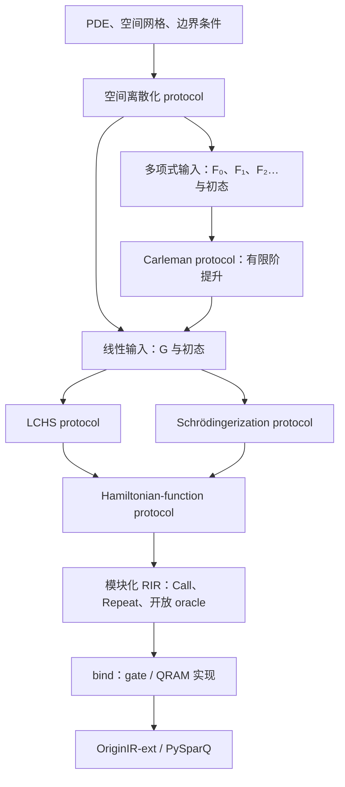

# 实现 QPDE/QODE：多种输入范式、可替换 oracle 与 protocol

本章说明 QPDE/QODE 的输入适配与算法组装。输入约定见 [算法自己的约定](contracts.md)：输入对象可同时满足多个 Python 协议，算法不依赖排他的全局类型标签。目标是让你能写出自己的 PDE 离散化、替换输入 oracle，再选择 LCHS、Schrödingerization 或 Carleman 组合成程序。完整可运行文件是 [examples/ode_input_models.py](../../examples/ode_input_models.py)；本文中的局部片段用于解释接口，完整脚本包含导入、数据、绑定和导出。

设计建议是：**问题层保留原始 input paradigm，适配器显式构造算法需要的输入，protocol 在 Python 中生成新的 oracle；RIR 保存生成后的模块及尚未实现的 oracle。** 不必给所有算法强加一种原始输入，也不要把任意两种 input model 当作可以免费互换。

下文分别说明现有接口、宿主适配函数和仍需提供的实现。结构可组装不等于论文的误差、成功概率或复杂度结论已经成立。

## 1. 从 PDE 到线路的分工



LCHS 和 Schrödingerization 是线性演化的两条实现路线。Carleman 负责把多项式非线性 ODE 提升成线性 ODE，因此通常组合成 `Carleman → LCHS` 或 `Carleman → Schrödingerization`，并不与后两者处在同一替换位置。

QPDE 比 QODE 多一个空间输入构造层。它负责网格编号、分量布局、边界条件、离散导数、系数、初值和强迫项；QODE 接收这些构造形成的有限维算子。量子地址寄存器中的网格编号与幅度中的未知场值不同：不能直接把幅度 `u_j` 当作 `compile_function` 的数值输入寄存器。

## 2. 三种对象、三个替换位置

| 对象 | 代码形态 | 替换方式 |
|---|---|---|
| Oracle paradigm | `BlockEncoding`、`SparseAccess`、`XorDatabase`、`StatePreparation` | 数学接口与寄存器约定；不同范式之间需要适配器 |
| Oracle implementation | `Operation`，可有门/QRAM 主体或 `body=None` | 同签名、同组装常量时使用 `bind` |
| Protocol | Python 函数、`partial`、闭包或可调用对象 | 换函数，然后重新生成上层算法 |

例如 `linear_qode("lchs", ...)` 是 protocol，`solver(G, initial, T)` 返回的 `StateOracle` 是一项具体算法操作。它内部的 `G` 可以还没有实现。未完成的是操作主体；寄存器位宽、BE 的 alpha、调用能力必须已经确定。

当前可直接使用的接口如下：

| 入口 | 输入与输出 | 使用位置 |
|---|---|---|
| `linear_qode(method, **config)` | 返回 `(G, initial, time) -> StateOracle` | 对应 `u'=Gu`，method 为 `lchs` / `schrodingerization` / `cbmd` |
| `lchs_qode(model, time, ...)` | `LinearODE(HermitianParts(L,H), initial)` | 对应 `u'=-(L+iH)u` |
| `schrodinger_qode(G, initial, time, ...)` | BE、态制备 → 输出态 oracle | 对应 `u'=Gu` |
| `carleman_qode(problem, time, linear_solver, cutoff=...)` | `PolynomialODE` → 输出态 oracle | 注入上述三参数线性 protocol |
| `hamiltonian_function(K, time)` | `BlockEncoding -> BlockEncoding` | 返回对 `exp(-iKt)` 的具体近似编码 |
| `make_qpde(qode, discretizer=...)` | `(problem, time) -> StateOracle` | discretizer 返回具有 `.generator/.initial` 的对象，如 `DiscretePDE` |
| `qpde_solver(qode, spatial_discretizer=...)` | `(problem, time) -> StateOracle` | discretizer 返回单个 model，再调用 `qode(model,time)`；适合 `PolynomialODE` |

两个 QPDE 工厂的调用约定不同。两个工厂都在 [pde.py](../api/algorithms/pde.rst)，通用线性求解入口在 [ode.py](../api/algorithms/ode.rst)，具体方法在对应算法文件中。不要直接把三参数 `linear_qode(...)` 传给默认的 `qpde_solver`。

可用 Python 的 `typing.Protocol` 在自己的应用里声明静态类型，但它不是新 IR 节点，也不自动证明算法前提：

```python
from typing import Protocol
from pyqecclang import BlockEncoding
from pyqecclang.algorithms.oracles import StateOracle, StatePreparation

class LinearSolver(Protocol):
    def __call__(self, generator: BlockEncoding,
                 initial: StatePreparation, time: float) -> StateOracle: ...

class HamiltonianFunction(Protocol):
    def __call__(self, hamiltonian: BlockEncoding,
                 time: float) -> BlockEncoding: ...
```

`LinearSolver` 在此用于说明调用形式。库中的 `QODEProtocol` 提供 contract/check，`QODEProblem` 提供问题入口。已有 QLSS 的 `LinearSystem/QLSSProtocol/SolveResult` 是另一套接口，QODE 的输入适配由各算法协议决定，完整范数恢复对象仍未提供。

## 3. Given oracle 应当允许哪些 input paradigm

建议应用侧保留“拥有哪种访问能力”，再显式选择适配。当前已有构件支持下列输入：

| Given input | 需要提供的内容 | 进入 QODE 的路径与边界 |
|---|---|---|
| 整体算子 BE | `target:n`、`signal:a`、`alpha`、矩阵解释、adjoint/controlled 能力 | 直接交给 `linear_qode`；必要时从 `G/G†` 构造 Hermitian parts |
| 分别给定 Hermitian parts | `L,H` 的 BE，`A=L+iH`，以及 `L>=0` 声明 | 直接交给 `lchs_qode`；避免先合并再分解 |
| CKS sparse position + entry | 原地位置置换、任意行列的数值 XOR、稀疏度、数值格式、元素界 | 用满足前提的 sparse→BE 构造；当前普通适配只覆盖实对称且非负对角 |
| XOR database | 可逆查询 `|j,z>→|j,z XOR d_j>`，明确数据字的含义 | 对角角表可用 `diagonal_block_encoding`；一般矩阵还需位置/制备/数值到幅度适配 |
| 可逆数值计算 oracle | 地址/物理参数保留，输出矩阵元数值字，附带状态位 | 与空间结构一起构造 entry oracle，再接数值到幅度转换；`compile_function` 可生成计算模块 |
| 结构化算子 | 移位、投影、Pauli 项、导数、对角系数、张量/分量选择 | 用 `lcu/product/tensor` 直接构造 BE，不必物化矩阵 |
| 多线性系数端口 | `F_p: C^(d^p)→C^d` 的矩形补齐 BE | 构造 `PolynomialODE`，再走 Carleman；不是把非线性映射本身当作 unitary |
| 初态制备 | `target:n`、`work:w`，从零态得到归一化向量，work 复净 | 独立的 `StatePreparation`；原始向量范数另行保存 |

### 3.1 直接给 BE 或 parts

BE 的约定是

$$
(\langle0^a|\otimes I)U_G(|0^a\rangle\otimes I)=\widetilde G/\alpha_G.
$$

这里 `U_G` 是实际线路，`G̃` 是该线路所编码的矩阵；与目标 `G` 的距离不由语言保证。`alpha_G` 参与后续组合，不能仅修改属性来“优化归一化”。

```python
from functools import partial
from pyqecclang.algorithms.ode import linear_qode
from pyqecclang.algorithms.hamiltonian import taylor_hamiltonian
from pyqecclang.algorithms.oracles import abstract_block_encoding, abstract_state_prep

G = abstract_block_encoding("Generator", width=2, signal_width=3, alpha=4.0)
initial = abstract_state_prep("Initial", width=2, work_width=0)
solver = linear_qode("schrodingerization",
                    hamiltonian_function=partial(taylor_hamiltonian, degree=1))
state = solver(G, initial, 0.05)
program = state.operation.program()  # 合法、仍包含 Generator/Initial 的开放 RIR
```

如果已给 `A=L+iH`，可以直接构造 `LinearODE(HermitianParts(L,H),initial)`。`HermitianParts.hermitian` 存的是 `L`，字段 `.h` 存的是 `H`；两者都应是 Hermitian，类型本身只检查宽度。给 Schrödingerization 时，现有入口要求 `G`，可显式用 `lcu([(-1,L),(-1j,H)])` 构造。当前没有直接消费 parts 的 Schrödingerization 优化入口。

### 3.2 XOR database 不是幅度访问

`diagonal_block_encoding(db, alpha=α, angle_scale=s)` 实际编码

$$
D_{jj}=\alpha\cos(s\,d_j/2).
$$

它先查询角度字，控制 `Ry`，再反查清理数值字。若目标是一个实对角系数 `c_j`，必须提供编码 `2 arccos(c_j/α)` 的角表，或用可逆计算生成该角度。**不能把存储 `c_j` 的定点表原样传入，便声称得到了 `diag(c_j)`。** 角度量化会改变实际编码矩阵。

教程用 2 位角度字、默认 `s=2π/4` 和表 `[0,1]`，得到 `A=diag(1,cos(π/4))`，再用 `G=-A` 接 LCHS。同一个开放数据库可以绑定 gate 表，也可以绑定 QRAM：

```python
from pyqecclang import Binding, bind
from pyqecclang.algorithms.oracles import abstract_database, diagonal_block_encoding, qram_database

angles = abstract_database("DiagonalAngles", 1, 2)
A = diagonal_block_encoding(angles, alpha=1.0)
closed_A = bind(A.operation.program(), {
    "DiagonalAngles": Binding(qram_database(1, 2).operation,
                              {"table": "diagonal_angles"}),
})
memory = {"diagonal_angles": [0, 1]}
```

表内容是运行输入，与 IR 中的资源声明分开。QRAM 可以替换数据存储实现，但它不会自动提供高效幅度加载、行态制备或矩阵的 block encoding。

### 3.3 稀疏位置与矩阵元分别开放

```python
from pyqecclang import FixedFormat
from pyqecclang.algorithms.oracles import abstract_sparse_access
from pyqecclang.algorithms.sparse import real_symmetric_sparse_encoding

fmt = FixedFormat(4, 1)
access = abstract_sparse_access("SparseA", width=1, value_width=4, sparsity=2)
A = real_symmetric_sparse_encoding(access, fmt, amax=1.0,
                                   diagonal_nonnegative=True)
```

这时未完成的是 `SparseA_position` 和 `SparseA_entry`，其余稀疏制备与 BE 模块已生成。当前位置接口以 `column` 保留、`index` 原地置换、`work` 复净为契约；前 `s` 个槽覆盖该列的非零位置。XOR 位置表不能直接替代完整置换。QRAM 普通实现使用正向、逆向两张表实现该接口。

entry 接口保留 `row,column`，将 `FixedFormat` 编码的值 XOR 到 `data`；必须定义任意行列输入，包括零元素。由 `sparse_entry(db,n)` 包装时，数据库地址是 `row + (column << n)`。示例矩阵 `[[1,-0.5],[-0.5,1]]` 的谱为 `{0.5,1.5}`，同时满足当前稀疏适配和 LCHS 的前提，`alpha_A=s*amax=2`。

当前 sparse→BE 构造是 `T†ST`，涉及 `sqrt(abs(value)/amax)` 的幅度转换与符号相位。数值字超过 12 位时默认转换模块保持开放，可用参数 `rotation=` 注入实现。`diagonal_nonnegative=True` 是调用者声明，不是对称性、界或半正定性的证明。非负对角也不意味着矩阵半正定。

一般复数/非对称稀疏矩阵需要另一套适配。尤其不能为了适配 QODE 就直接把 `G` 替换成 `[[0,G],[G†,0]]` 并演化：后者的指数没有自动等于 `exp(tG)` 的物理输出块。QLSS 的 Hermitian dilation 技巧不等于 QODE 的动力学变换。相关输入区别见 [QFVM/QLSS 审查](qfvm.md)。

### 3.4 初态也有独立的 input paradigm

`gate_state_prep(values)` 给出完整酉扩张的门实现，自动归一化；`qram_state_prep(n,b)` 查询专用制备角表，其 work 宽度是 `max(1,n)+b`，角表可由 `qram_state_angles(values,b)` 构造。当前 QRAM 辅助函数只接受非负实幅度；带符号或复相位需另行实现，不能据此宣称已有相应数据库制备。它的资源 `angles` 不是原始幅度值表。

开放初态槽应明确需要 inverse/controlled；若使用 LCU、反射或受控张量制备，这些能力不可缺失。Carleman 还必须接收原始 `initial_norm`。多次制备张量幂是重复调用初态 oracle，需要一致的相干相位约定；并非复制一份未知量子态。

## 4. LCHS：从输入到完整生成函数

先固定符号：通用接口描述 `u'=Gu`；LCHS 原始接口描述 `u'=-Au`。两者以 `A=-G` 对齐。写

$$
A=L+iH,\qquad L=(A+A^\dagger)/2,\quad H=(A-A^\dagger)/(2i).
$$

在自治情形、`L>=0` 下，LCHS 使用

$$
e^{-At}=\int_{\mathbb R}\frac{e^{-it(H+kL)}}{\pi(1+k^2)}\,dk.
$$

这里不要求 `H` 与 `L` 对易。构造依据是 [LCHS 原文 Theorem 1](https://arxiv.org/html/2303.01029v2)。本库当前只实现自治齐次接口；原文的时间依赖与非齐次结果不自动成为本库能力。

落实成生成步骤：

1. 选择节点 `k_j` 和已经包含积分核的复权重 `w_j`。
2. 生成 `K_j=H+k_j L` 的 BE，`alpha_Kj=alpha_H+|k_j|alpha_L`（零系数项剔除）。
3. 调用可替换的 `hamiltonian_function(K_j,t)`，得到近似演化 `E_j` 的 BE，保留其 `alpha_Ej`。
4. 用 `lcu([(w_j,E_j),...])` 构造有限和 `Ṽ=Σw_j E_j`。
5. 先调用初态制备，再调用 `Ṽ`。返回 `StateOracle(target,signal)`，成功子空间为全部 signal 为零。

核心组装本身很短，下面是可供自定义 protocol 采用的已有 API 组合：

```python
from pyqecclang.algorithms.block_encoding import lcu
from pyqecclang.algorithms.state_preparation import apply_be_to_state

def assemble_lchs(model, time, plan, hamiltonian_function):
    terms = []
    for node, weight in zip(plan.nodes, plan.weights, strict=True):
        K = lcu([(1, model.parts.h), (node, model.parts.hermitian)])
        E = hamiltonian_function(K, time)  # 必须是 BE，且仍是 exp(-i K time) 的约定
        terms.append((weight, E))
    evolution = lcu(terms)
    return apply_be_to_state(evolution, model.initial)
```

正式入口 `lchs_qode` 还会记录节点、核与演化 alpha 等元数据。`QuadraturePlan.cauchy(cutoff=J,spacing=h)` 生成 `k=-Jh,...,Jh` 和 `w=h/[π(1+k²)]`。这是有限求和候选，不做尾积分保证；不要把权重强行归一化后仍称为同一个近似算子。

当前 `taylor_hamiltonian(K,t,degree=r)` 返回

$$
\widetilde E=\sum_{\ell=0}^r\frac{(-it)^\ell}{\ell!}K^\ell,
\quad\alpha_E=\sum_{\ell=0}^r\frac{|t|^\ell\alpha_K^\ell}{\ell!}.
$$

它是一个非酉多项式的 BE；并不是直接作用于 target 的精确 HamSim。LCU 正确使用 `Σ|w_j|alpha_Ej` 作为演化的归一化常数。生成配置里的 `degree`、节点和将来可能出现的 `eps` 均为宿主参数。

### 替换内部 protocol

```python
from functools import partial
from pyqecclang.algorithms.lchs import QuadraturePlan
from pyqecclang.algorithms.ode import linear_qode
from pyqecclang.algorithms.hamiltonian import taylor_hamiltonian

config = QuadraturePlan.cauchy(cutoff=1, spacing=1.0)
solver1 = linear_qode("lchs", plan=config,
                     hamiltonian_function=partial(taylor_hamiltonian, degree=1))
solver2 = linear_qode("lchs", plan=config,
                     hamiltonian_function=partial(taylor_hamiltonian, degree=2))
```

这是同一个 protocol 实现的配置替换。替换为另一种算法时，写新的 `(K,t)->BlockEncoding` 函数即可，但它必须能处理实际传入的 `K` input model，并兑现演化方向、alpha、signal、controlled/adjoint 及反算契约。库内没有通用 QSP-HamSim 实现可直接用一个名字启用。

若已有仅接受 Pauli 列表的 Trotter 实现，它不能从任意黑盒 BE 自动恢复 Pauli 分解。应在上层保留该结构，写显式适配器或另一个 solver 生成器。`algorithms/legacy.py` 中保留的 `make_lchs_qode(ham_sim,times,weights)` 只是调用方自备分解的 LCU 框架，未构造一般 `H+kL`；新算法应使用本文入口。

## 5. Schrödingerization：辅助坐标也保留为寄存器

对 `u'=Gu` 定义 `G=H₁+iH₂`。引入辅助变量 `p`，在有效恢复区域使用 `v(t,p)=exp(-p)u(t)`，初值对两侧延拓为 `v(0,p)=exp(-|p|)u₀`，则提升方程为

$$
\partial_t v=-H_1\partial_p v+iH_2v.
$$

Fourier 化后成为 Hermitian Hamiltonian 演化。本文实现的张量顺序为辅助坐标在高位、原物理坐标在低位，对应

$$
K=P\otimes H_1-I\otimes H_2.
$$

依据是 [Schrödingerization 技术论文 §3.1](https://arxiv.org/html/2212.14703v1)。张量顺序差异要通过寄存器布局处理，不能直接照抄另一种矩阵向量化顺序。

已有生成器逐步完成：

1. 从 `G/G†` 得到 `H₁,H₂`。
2. 用 `fourier_momentum` 的按位投影 LCU 构造频率对角算子 `P`，再构造 `K` 的 BE。
3. 在 `target[:n]` 调用原始初态，在 `target[n:]` 制备归一化的 `exp(-|p_j|)`，对辅助寄存器做 QFT。
4. 调用同一个 `hamiltonian_function(K,t)` protocol。
5. 对辅助寄存器做逆 QFT，选择一个 `p` 通道，将该通道选择并入返回的 signal。

```python
from functools import partial
from pyqecclang.algorithms.schrodingerization import SchrodingerPlan
from pyqecclang.algorithms.ode import linear_qode
from pyqecclang.algorithms.hamiltonian import taylor_hamiltonian

solver = linear_qode(
    "schrodingerization",
    plan=SchrodingerPlan(auxiliary_width=2, period=8.0, selected_index=1),
    hamiltonian_function=partial(taylor_hamiltonian, degree=1),
)
# solution = solver(G, initial, 0.05)
```

这个配置下辅助网格按编码顺序为 `[0,2,-4,-2]`，选择的是 `p=2`。当前实现不自动检验该点是否位于恢复区，也不保证周期窗口足够大；一般需要根据 Hermitian 部分的传播速度、时间和周期边界选择窗口与通道，不能仅以 `p>0` 作为所有问题的充分条件。Fourier 正负号、有限网格与恢复区的整体数值验证仍待完成。

**恢复幅值需要保存完整尺度。** 记初态向量范数为 `r`，离散 warp 向量的范数为 `Z=√Σ_j exp(-2|p_j|)`，演化 BE 的 alpha 为 `α_E`。在理想恢复关系成立时，选定成功块约为

$$
|\psi_{\rm good}\rangle
\approx\frac{e^{-p_j}}{rZ\alpha_E}|u(t)\rangle.
$$

源码的 `recovery_scale=exp(p_j)` 只记录 warp 的一个因子；**它不是完整范数恢复接口**。当前 `schrodinger_qode` 返回 `StateOracle`，不会统一返回 `r,Z,alpha_E` 的 readout plan。若业务需要物理幅值，应在宿主配置/结果对象中保留这些量并另做概率估计。本文示例验证组装和导出，不把后选择方向与完整经典 PDE 解数组混为一谈。

`algorithms/legacy.py` 中历史入口 `make_schrodingerisation_qode(embedding,ham_sim,...)` 由调用者自行负责 embedding，未自动完成这里的 warped 初态/QFT；新实现使用 `schrodingerization.py`。

## 6. Carleman：把非线性写成多线性输入端口

先把空间离散后的方程表达为

$$
u'=\sum_{p=0}^D F_pu^{\otimes p},\qquad u^{\otimes0}=1.
$$

这里 `F₀` 是常量向量、`F₁` 是线性算子、`F₂` 是二输入到一输出的线性张量收缩。`F₂(u⊗u)` 对 `u` 非线性，但 `F₂` 对整个张量输入是线性的，可以作为 BE 的对象。

令 `y_k=u^⊗k`，乘积法则给出

$$
y_k'=\sum_{p=0}^D\sum_{j=0}^{k-1}
(I^{\otimes j}\otimes F_p\otimes I^{\otimes(k-j-1)})y_{k+p-1}.
$$

有限截断 `K` 保留 `y₀,...,y_K`，丢弃来源阶数大于 `K` 的项，得到线性生成元 `G_K`。这部分有限矩阵构造是确定的；它逼近原非线性方程的程度取决于截断与适用条件。量子算法的收敛/效率依据可参考 [Carleman 论文](https://arxiv.org/abs/2011.03185v4)，不能从“可以生成有限矩阵”推出。该文 v4 已包含已发表版本的修正，本文不沿用未经核验的旧误差界。

### 6.1 F_p 的寄存器契约

若原始向量维度 `d=2^n`：

| 端口 | BE target 宽度 | 零信号块中的有效矩阵 |
|---|---|---|
| `F₀` | `n` | 首列为强迫向量，其他列为零 |
| `F₁` | `n` | `d×d` |
| `F_p, p>=2` | `p*n` | 前 `d` 行为 `d×d^p` 张量收缩，其余行严格为零 |

输入张量 factor 0 位于最低的 `n` 位。`F_p` 输出保留在最低 `n` 位，其余目标位在成功块为零。每个端口各有自己的 alpha 和 signal 宽度。代码检查 target 宽度，**不证明矩形零填充或数值语义**。

Carleman 当前布局为 `target[:K*n]` 的固定大小数据区和高位 `level`，后者宽度是 `K.bit_length()`，承载阶数 `0..K`。阶数 `k` 的有效数据只占前 `k*n` 位，其余为零。它采用补齐布局，不是紧凑的 `1+d+...+d^K` 地址；这一资源差别应保留在报告里。

### 6.2 从普通 PDE 得到这些端口

以周期 Burgers 方程为例：

$$
u_t=0.1u_{xx}-u u_x.
$$

中心差分后 `F₁=0.1D₂`。若低位 factor 0 对应 `u`、高位 factor 1 对应 `u_x`，则 `F₂[j,i₀+d*i₁]=-δ[j,i₀]D₁[j,i₁]`，即 `F₂=-C(D₁⊗I)`，其中同点收缩 `C` 只保留两个输入坐标相同的分量。已有结构化实现通过移位 LCU、坐标 XOR、条件旗标和系数乘子生成这些模块。

```python
from pyqecclang.applications.qham import Discretization, Field, Grid, PolynomialPDE, structured_fd_bindings

u = Field("u")
pde = PolynomialPDE.from_equations({"u": 0.1*u.d("x", 2) - u*u.d("x")})
grid = Grid(("x",), (4,), (1.0,), boundary="periodic")
space = Discretization(pde, grid)
initial_values = space.encode_fields({"u": [0.1, 0.2, 0, -0.1]})
ports = structured_fd_bindings(space, initial_values)
```

这一步借用 `qham` 包内已有的 PDE/离散化与端口生成器，**并没有执行 HAM 递推**。此时可以把同次数的各项 BE 相加，转成 `PolynomialODE`。完整脚本中的宿主函数如下：

```python
from collections import defaultdict
from pyqecclang.algorithms.block_encoding import lcu
from pyqecclang.algorithms.carleman import PolynomialODE

def polynomial_from_bindings(bindings):
    grouped = defaultdict(list)
    for _, port in bindings.ports:
        grouped[port.arity].append((1, port.encoding))
    return PolynomialODE(
        bindings.state_width,
        tuple((p, lcu(terms)) for p, terms in sorted(grouped.items())),
        bindings.initial,
        bindings.initial_norm,
    )
```

该函数位于示例文件，不是新的核心 API。不要猜测 `B_1/B_2` 之类端口名就是多项式次数；使用 `PortBinding.arity` 分组。也可以完全不使用 PDE 前端，直接提供开放的 `F_p` BE 或由 QRAM/算术构造的端口。

```python
from functools import partial
from pyqecclang.algorithms.pde import PDEInput, qpde_solver
from pyqecclang.algorithms.carleman import carleman_qode
from pyqecclang.algorithms.ode import linear_qode
from pyqecclang.algorithms.hamiltonian import taylor_hamiltonian

problem = polynomial_from_bindings(ports)  # ports 来自前面的 Burgers 离散化
linear_solver = linear_qode("schrodingerization",
                           hamiltonian_function=partial(taylor_hamiltonian, degree=1))
nonlinear_solver = partial(carleman_qode, linear_solver=linear_solver, cutoff=2)
qpde = qpde_solver(nonlinear_solver)
solution = qpde(PDEInput(problem, "burgers"), 0.05)
```

当前结构化差分绑定要求各轴长度为二次幂、周期边界；已知变系数有门表规模上限，默认 4096 个字。其他边界、数据结构与系数 oracle 可以写自己的端口实现，不能把 `Grid` 支持某个经典边界理解为量子 lowering 已覆盖该边界。

### 6.3 初态、输出与替换线性 solver

`carleman_initial` 制备的归一化提升向量是

$$
\frac{(1,u_0,u_0^{\otimes2},...,u_0^{\otimes K})}
{\sqrt{\sum_{k=0}^K\|u_0\|^{2k}}}.
$$

所以 `initial_norm` 决定各阶的相对幅值，不是可省略的装饰属性。代码调用初态 oracle 多次；当前公开 work 预留 `K*initial.work_width`。`carleman_qode` 最后选择 level 1 并要求其余数据位为零，把选择条件并入 signal。

提升后的 `G_K` 不保证耗散，尽管原始 PDE 或 `F₁` 可能耗散。因此：

- 接 Schrödingerization：可以直接传 `G_K`，再单独判断辅助恢复区和有限网格条件。
- 接 LCHS：必须确认 `Hermitian(-G_K)>=0`，或显式变换。

一种保守变换是选择 `μ>=alpha_GK`，令 `z'= (G_K-μI)z`，则 `y(t)=exp(μt)z(t)`。只要 BE 的矩阵契约成立，`μ` 便是足以保证该移位耗散的上界。**移位要作用于整个提升系统，包括 level 0**，否则不是统一的幅值重标度。

完整脚本中的 `shifted_solver` 正是一个三参数 protocol 包装器：生成 `lcu([(1,G_K),(-μ,I)])`，调用 LCHS，并在宿主报告保存 `growth_shift` 和 `log_amplitude_rescale=μt`。它没有假称返回 `StateOracle` 就已经恢复了范数。对于不满足前提的输入，移位及其成功概率代价应在应用配置中可见。

这与 QHAM 的一般有限闭包不同：Carleman 丢弃张量尾项；QHAM 的 QCL 表示针对已选 HAM 截断建立闭包。二者可以共享 `F_p` 与线性 QODE protocol，但截断含义不能混同，见 [QHAM 数学推导](../reference/qham-derivation.md)。

## 7. 一个线性 QPDE 如何替换 solver

对于周期热方程 `u_t=νu_xx`，可以直接构造空间离散化 BE：

```python
from pyqecclang import scale
from pyqecclang.algorithms.oracles import gate_state_prep
from pyqecclang.applications.qham import Grid
from pyqecclang.applications.qham.stencils import derivative_encoding
from pyqecclang.algorithms.pde import DiscretePDE, make_qpde

grid = Grid(("x",), (4,), (1.0,), boundary="periodic")
G = scale(0.1, derivative_encoding(grid, (("x", 2),)))
problem = DiscretePDE(G, gate_state_prep([1, 0, 0, 0]), "periodic_heat")
# result = make_qpde(linear_solver)(problem, 0.05)
```

`derivative_encoding` 由有限差分位移构成 `S+S†-2I` 的 LCU。此例的 `G` 为负半定，因此 LCHS 的 `A=-G` 前提成立。把 `linear_solver` 从 LCHS 换成 Schrödingerization 后，空间输入不变；重新生成量子程序即可。

更一般的 `discretizer(problem)` 可以返回由 sparse、QRAM 或可逆数值计算适配得到的 `DiscretePDE`。建议问题对象中保存边界、网格、量纲、物理维度、补齐布局、初始范数和原始访问类型。**只在明确的算法适配边界提取 BE**，使以后能替换成直接消费 sparse 或 Hamiltonian 项列表的 solver。

当前 `DiscretePDE` 只含 generator、initial 和 label，不替你保存这些应用元数据，也不为 PDE 自动选择空间格式。对自治非齐次系统 `u'=Gu+f`，可显式构造 `[u;1]'=[[G,f],[0,0]][u;1]` 或使用 Carleman 的 `F₀`；不能只增加一个初态 oracle 就完成源项积分。`G(t)`、`f(t)` 的时间 oracle、时间排序和通用源项读出尚无统一现成接口。

## 8. 分批绑定：何时替换 oracle，何时重新生成

完整脚本的 XOR 两个案例共用同一开放程序，仅替换绑定：

```python
gate_bindings = {
    "DiagonalAngles": gate_database(1, 2, [0, 1]).operation,
    "Initial": gate_state_prep([1, 1], work_width=3).operation,
}
qram_bindings = {
    "DiagonalAngles": Binding(qram_database(1, 2).operation,
                              {"table": "diagonal_angles"}),
    "Initial": Binding(qram_state_prep(1, 2).operation,
                       {"angles": "initial_angles"}),
}
# gate_program = bind(open_program, gate_bindings)
# qram_program = bind(open_program, qram_bindings)
```

开放 `Initial` 预先声明了 `work_width=3`，门实现也预留同样工作位，故能与该 QRAM 实现互换。抽象声明的 work 若为 0，就不能直接绑定 work 为 3 的实现；可以显式写接口包装器，或重新生成上层程序。

| 变化 | 操作 |
|---|---|
| 同一槽位、同种范式、同寄存器类型/宽度、同 alpha、兼容能力 | `bind`，保留原有调用结构 |
| 实现需要 QRAM 资源 | 用 `Binding.resources` 映射到入口逻辑资源，链接器沿调用链提升资源参数 |
| 实现内部还有新开放槽 | 允许部分绑定，继续保存 RIR；`unresolved` 会报告后续缺口 |
| alpha、signal/work/target 宽度或 input paradigm 改变 | 重新运行适配器及上层 protocol；不要直接改 JSON 属性 |
| 积分节点、Taylor 阶数、Carleman 截断、辅助网格改变 | 重新生成相应算法及调用它的上层模块 |
| 完全换 LCHS / Schrödingerization / 内部 HamSim 算法 | 更换 Python protocol，重建输出布局；数值前提重新评估 |

`bind` 按参数位置核对寄存器类型，明确的范式、alpha 与调用能力也需兼容；不证明两个实现确实编码同一个矩阵。QRAM 数据改变可能使矩阵范数、耗散或元素界声明失效，宿主必须同步维护这些契约。

protocol 没有被序列化成任意 Python callback。若一个 protocol 的**生成结果**仍未实现，可以返回一个签名/alpha 已确定的开放 oracle；但整个操作黑盒的数学输入依赖需由应用记录，不能让空声明冒充已经构造的 `H+kL` 或 Hamiltonian 演化。通常优先运行已知的结构生成器，只把真正缺失的底层 oracle 保留为 `body=None`。

## 9. 输出语义、参数与验证责任

| 信息 | 放在哪里 | 当前保证 |
|---|---|---|
| 寄存器位宽、资源、模块调用 | RIR | 结构检查、视图/别名检查 |
| BE alpha | `be_alpha` 与组合库 | 按声明传播；不证明与目标矩阵相符 |
| 数值格式、元素上界、截断与采样配置 | Python 配置和生成属性/宿主报告 | 生成具体线路；不自动得出精度 |
| Hermitian、耗散、零填充、复净 | 算法输入契约与验证记录 | 部分执行器可检查复净，语言不证明这些数学性质 |
| 初态范数、warp 范数、增长移位、物理通道 | 宿主 problem/result/readout 记录 | 普通 QODE `StateOracle` 尚未统一保存全部尺度 |
| PDE 离散误差、截断误差、成功概率、优势 | 算法验证层 | 仍待核验，不进入核心 eps 类型 |

LCHS 返回的成功块是 `Ṽ|u₀>/alpha_V`；原始 `u₀` 已归一化，所以物理幅度还含初值范数。Schrödingerization 额外有 warp 和通道因子，Carleman 额外有提升初态范数与一级通道。测量 `signal==0` 后只能得到归一化方向；恢复经典场值或其范数还需要额外读出方案。

这符合“语言负责可组装、精度由生成函数和应用负责”的设计。但应用必须能找到这些契约：建议每个 solver 配套宿主结果记录，而不是靠零散 metadata 推断数学结论。当前 QODE 协议提供输入检查，但没有统一的物理范数恢复对象。

## 10. 运行与验证

在仓库根目录执行：

```bash
PYTHONPATH=src .venv/bin/python examples/ode_input_models.py

# 用已安装真实 uniqc 的解释器验证导出语法：
PYTHONPATH=src /path/to/backend/python examples/ode_input_models.py --native-parse

# 另用真实 PySparQ 比较角数据库案例的 gate/QRAM 绑定：
PYTHONPATH=src /path/to/backend/python examples/ode_input_models.py --native-parse --native-bindings
```

本工作区可用 `../QECC.Lang/.venv/bin/python` 执行第二条命令。输出位于被 git 忽略的 `out/ode-input-models/`，包含：

| 案例 | 给定的输入 / 组装 |
|---|---|
| `given_be_lchs` | 整体 G 的 BE 与开放初态 |
| `given_parts_lchs` | 分别给定 L/H 的 BE |
| `given_xor_gate_lchs`、`given_xor_qram_lchs` | 相同开放角数据库/初态，分别绑定 gate 与 QRAM |
| `given_sparse_gate_lchs`、`given_sparse_qram_lchs` | 相同位置/元素槽，分别绑定 gate 与 QRAM |
| `heat_lchs`、`heat_schrodingerization` | 同一个空间离散化，替换线性 QODE protocol |
| `burgers_carleman_schrodingerization` | PDE → 开放 F₁/F₂ → Carleman → Schrödingerization |
| `burgers_carleman_shifted_lchs` | 相同 F₁/F₂，Carleman 后显式移位并接 LCHS |
| `heat_lchs_taylor2` | 替换内部 Hamiltonian-function 配置 |

每个目录包含 `open.rir.json`、`closed.rir.json`、`modular.originir`、`toffoli_u3_cz.originir`、`memory.json` 和 `report.json`；有绑定的案例还保存第一次绑定后的 `partial.rir.json`。无开放槽的案例，其 open/closed 描述相同。统一索引为 `index.json`。

随项目提供的 11 个案例均通过 RIR 序列化往返、闭合检查、两种 OriginIR 导出，并用真实 `OriginIR_BaseParser` 解析严格门集产物。此验证确认描述可消费，不证明有限 Taylor、积分截断、Fourier 恢复或 Carleman 的数值求解正确性。原始模块调用在 pyqecclang RIR 和导出的 DEF 中保留；下游解析器内部仍会展开 DEF。

`--native-bindings` 只比较 `given_xor_gate_lchs` 与 `given_xor_qram_lchs` 的完整复幅度，记录为 `binding-validation.json`。其他案例并不因此获得量子态正确性结论。稀疏 gate-LCHS 案例展开后有 1,936,453 个执行事件，超过 PySparQ 适配器默认一百万步预算；该案例已完成描述与解析验证，没有通过扩大模拟范围来代替算法验证。

角数据库绑定对拍的最大复幅度差为 0；`tests/core/test_differential.py` 的 4 个测试（含 3 个 subtest）通过，`ruff check src tests examples tools` 通过。文档链接和 Python 片段语法已检查。

## 数值验证

本章组装链路的论文级数值实验见 `tests/verification/verify_ode.py`（ode 组，覆盖 `ode.py`、`ode_models.py`、`carleman.py`、`lchs.py`、`cbmd.py`、`schrodingerization.py`）。经典参考全部独立：numpy/scipy（`expm`、`solve_ivp`、解析解、按公式直求的计划恒等式）与纯 Python 见证（`sde.matrix_exponential`）；量子程序在真实后端 reference、rir-pysparq、adapter-pysparq、OriginIR-ext（UniQC 全振幅与 `to_matrix`）上执行。实现误差（量子对独立仿真）与方法误差（算法余项对精确解，库中标注 pending 的部分）一律分开报告。

**实验设计**：(a) 子结构——`taylor_hamiltonian` 编码块、`fourier_momentum` 动量块、Carleman 提升块 $G_K$ 与提升初态的逐元素/逐振幅对拍，CBMD/LCHS 计划权重对独立闭式与 $t=0$ 轮廓恒等式；(b) 多输入模型端到端——§3 的五种输入范式（整体 BE、直接 parts、对角谱角数据库 gate/QRAM 绑定、Fokker–Planck Pauli 展开 + `QODEProblem`、结构化热方程移位 BE）各跑 LCHS 端到端；(c) CBMD 与 LCHS 同一非对易问题对拍；(d) Schrödingerization 组装保真度、恢复关系与符号约定侦测；(e) Carleman 对 Riccati 非线性的端到端与截断阶收敛趋势。

**关键指标**：

| 案例 | 规模 | 路径 | 误差 / 指标值 |
|---|---|---|---|
| 子结构 4 例（taylor 块 / 动量块 / 提升块 / 提升初态） | 4–10 量子位 | originir+to_matrix、四路径 | 3.4e-16 / 2.2e-16 / 3.4e-16 / 0.0 |
| LCHS 整体 BE（$G=-I$） | 7 量子位 | 四路径 | 实现 1.2e-16 / 方法 1.2e-2 |
| LCHS 非对易 parts | 15 量子位 | 三路径 | 实现 1.1e-16 / 方法 7.3e-2 |
| LCHS 角数据库 gate vs QRAM | 2×程序 | reference | 实现 5.8e-17 / 绑定差 0.0 |
| LCHS + Fokker–Planck OU | 16 量子位 | reference、originir | 实现 1.1e-16 / 方法 7.9e-2 |
| LCHS 热方程结构 BE | 15 量子位 | reference、originir | 实现 1.7e-17 / 方法 0.19 |
| CBMD 同题对拍 | 15 量子位 | reference、originir | 实现 1.1e-16 / 方法 9.1e-3 / 方向误差 CBMD 3.0e-3 vs LCHS 4.5e-2 |
| Schrödingerization 衰减 | 21 量子位 | 双路径 | 组装保真 8.7e-19；恢复给出 $e^{+t}$（符号侦测 4.8e-16） |
| Schrödingerization 符号翻转构造 | 21 量子位 | 双路径 | 网格误差 1.3e-16（经典精确演化） |
| Schrödingerization 旋转 | 21 量子位 | 双路径 | 实现 2.2e-18 / 恢复误差 1.5e-5 |
| Carleman Riccati 端到端 | 18 量子位 | reference、rir | 实现 2.8e-17 / Taylor 余项 1.4e-4 / 截断 1.1e-3 |
| Carleman 截断趋势 K=1→3 | $t=0.2$ | 量子+经典 | 9.3e-3 → 1.1e-3 → 1.05e-4 |

两项库级发现随验证产出：(1) Schrödingerization 的动量项符号与文档恢复关系相反（恢复为时间反演解；符号翻转构造后恢复精确，详见 [Schrödingerization 页](algorithms/schrodingerization.md#数值验证)）；(2) pysparq 两实现（rir/adapter）在深嵌套 LCU 程序的 junk 分支上存在约 1e-7 的数值地板（剪除 <1e-7 振幅与 ~0.3% 相对抖动），reference 与 OriginIR-ext 在相同分支一致到 1e-17；所有物理后选择块在所有路径上仍一致到 1e-9 以内。LCHS/CBMD 的方法误差为各自文档标注 pending 的求积/省略余项；Carleman 截断误差每升一阶约降一个量级。

**复现**：

```bash
PYTHONPATH=src /home/agony/projects/qcfd-dev/quantum-cfd-software/.venv/bin/python tests/verification/verify_ode.py
```

产物：`out/verification/ode.json`（27 个案例）。

继续阅读：[oracle 目录](operators.md)、[开放绑定规范](../reference/open-ir.md)、[一般 QHAM 实现](qham.md)、[数学函数编译](math-functions.md)。
