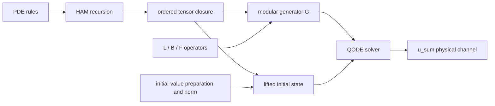

# General QHAM automatic generation: PDE → HAM → QCL → QODE

**English** · <a href="../zh/manual/qham.html">简体中文</a>

The QHAM generator connects regularized PDEs, finite-order HAM derivations, and quantum-adapted linearization to QODE inputs. Read the [mathematical derivation](../reference/qham-derivation.md) first, then supply grids, coefficients, and initial states as described in this chapter; the minimal runnable example is in [tutorial: generating QHAM inputs from PDE expressions](../tutorials/qham.md). The construction follows the [QHAM paper](https://arxiv.org/html/2411.06759v2).

The "secondary linearization" here means exactly secondary linearization: one more quantum-adapted linearization applied to the HAM deformed equations. The program supports quadratic, cubic, and higher finite degrees within the rules at the same time; it does not first truncate higher-degree nonlinearity into quadratic terms.

## 1. The precise scope of "generality"

The input is an autonomous first-order time-evolution PDE system. Allowed:

- any finite number of components and finite spatial dimension;
- finite polynomials of the unknown fields and their spatial derivatives;
- known spatial coefficients, known forcing, and their spatial derivatives;
- an outer spatial derivative applied to a complete monomial;
- any non-negative HAM truncation order m, constrained by the explicit generation budget and the bit-width limits of the current quantum interfaces.

For example:

```python
from oracq.applications.qham import Field, Known, PolynomialPDE, QHAMPlan

# Declare two unknown fields u and v: each is a monomial atom participating in
# polynomial arithmetic.
u, v = Field("u"), Field("v")
# Write the equation right-hand sides with ordinary Python operators: u.d("x", 2) is the
# second spatial derivative, u*u.d("x") is the quadratic advection term, and Known("f")
# is known forcing data referenced by name. from_equations validates and freezes into an
# immutable term set, while splitting out the L/F/B ports.
pde = PolynomialPDE.from_equations({
    "u": 0.1*u.d("x", 2) - u*u.d("x") + Known("f"),
    "v": -0.3*v + 0.2*u*v - 0.1*v**3,
}, axes=("x",), label="coupled_flow")

# HAM truncation order m=3: the plan stores only the PDE and the order; the block closure
# is generated lazily, without materializing matrices.
plan = QHAMPlan(pde, order=3)
```

Division of unknown fields, transcendental functions, unresolved pressure constraints, general implicit time equations, and time-dependent bindings are outside the first batch of rules. They cannot be treated as the same implemented algorithm merely by changing a label. The mathematical positions of time-varying eta/L/f/B are preserved in the derivation, but the current QODE assembly requires autonomous bindings.

Outer derivatives remain operator actions; for example (u*u).d("x") denotes, after discretization, D_x acting on the same-point product. The program does not secretly rewrite it as 2*u*D_x(u), because finite differences generally do not satisfy the exact Leibniz identity. Nonlinear expressions carrying an outer derivative currently cannot continue to serve as product factors; such forms must be rewritten explicitly as allowed monomial rules, or multilinear ports must be provided.

Initial values, boundaries, and spatial discretization are supplied by bindings. The formal PDE derivation itself neither chooses boundary conditions for the user nor proves well-posedness.

## 2. What the automatic derivation actually generates

The entry point [pde.py](../api/applications/qham/pde.rst) splits the expressions into known linear maps:

```text
u' = f + L u + sum_tau B_tau(u,...,u).
```

L contains all linear terms, F denotes the vector injection of f, and each nonlinear monomial forms one multilinear B_tau. The ports carry the PDE coefficients; for example Burgers' B carries the minus sign and KdV's B carries the -6 — you cannot bind a bare multiplication lacking these coefficients.

[linearization.py](../api/applications/qham/linearization.rst) automatically generates:

1. the HAM recursion for the Ui of each order, using the -eta(1+eta)^(i-1-l) weights;
2. the ordered tensor words Y_(a0,...,ak-1) and their linear couplings;
3. the physical output block u_sum=sum(Ui);
4. the constant component one required by non-zero forcing;
5. block dimensions, offsets, index ranking/unranking, and row-by-row operator rules.

The finite closure for maximum nonlinearity degree D takes

```text
max(1,D-1)*sum(a_j)+len(a) <= max(1,D-1)*m+1.
```

The tensor rank in the closure is finite, and nonlinear substitutions strictly decrease the HAM order sum. It represents **the truncated HAM system** exactly, without a further Carleman-style higher-order truncation. Higher-degree PDEs use a canonical closure superset that may contain redundant but closed variables.

{obj}`QHAMPlan <oracq.applications.qham.linearization.QHAMPlan>` is a lazy object: it stores only the PDE and m. At quadratic without forcing and m=20 it can describe 2^21 function blocks without writing all of them into serialized text. row_terms, offset, and locate can be queried individually. When an explicit export exceeds the budget, the plan remains valid and is not disguised as an already-expanded circuit.

## 3. Two serializable representation layers



| Representation | Role | Contains quantum gates? |
|---|---|---|
| PDE 0.1 | fields, spatial axes, monomials, known coefficients, and inner/outer derivatives | No |
| QCL plan 0.1 | PDE + HAM order, plus the deterministic finite closure rules | No |
| RIR 0.3 | actual registers, {obj}`Call <oracq.infrastructure.ir.Call>`, controls, rectangular windows, work bits, and BE composition | Yes; module calls are kept |

The formats are defined in [PDE Schema](../reference/schemas/pde.schema.json) and [QCL Schema](../reference/schemas/qcl-plan.schema.json). PDE/QCL contains no Python callbacks and can be rebuilt from JSON. rows.json or quantum modules are generated only on explicit request.

"Automatic quantum compilation of mathematical functions" and the PDE construction surface here have different objects: compile_function performs reversible computation on values in basis-state registers, whereas {obj}`Field <oracq.applications.qham.pde.Field>` expressions describe the fields to be solved and their amplitude encoding. An out-of-place numeric function circuit cannot be taken directly as imposing a nonlinear PDE on quantum amplitudes. QHAM handles the latter by enlarging the linear state space.

## 4. How lowering to register-level quantum modules works

The implementation is in [quantum.py](../api/algorithms/input_model/qham.rst) and [stencils.py](../api/applications/qham/stencils.rst).

Every port is interpreted as a rectangular linear map:

| Port | Input | Output |
|---|---|---|
| L | V | V |
| B_tau | r-fold tensor product of V | V |
| F | the scalar constant space | V |

They are carried by padded BEs, with alpha and ancilla counts given by the concrete implementation. QCL places these ports at designated tensor positions and acts as the identity on the other coordinates; forcing acts by inserting a new coordinate, and nonlinearity by contracting several coordinates.

Rectangular blocks must check both the input and the output window. The global layout is not a uniform-width block layout, and input/output zero padding must not spill into neighboring blocks. The program implements the embedding with reversible address shifts, coordinate permutations, and two window-failure flags.

The ordinary structured implementation for periodic grids consists of:

- finite-difference derivatives composed of a few reversible shifts and an LCU;
- component selection realized by input-component projection and output-component encoding;
- same-point products realized through spatial coordinate XOR, a diagonal condition, and rectangular contraction;
- outer derivatives acting after the contraction;
- known coefficients using a diagonal-multiplication BE; the current ordinary gate version has an explicit word-count budget.

This path never materializes the N^r×N^r basis-port matrices, let alone the whole lifted matrix. There is also {obj}`gate_bindings <oracq.algorithms.input_model.qham.gate_bindings>`, which specifically materializes very small basis ports for comparison; it is not the general path.

Example:

```python
from oracq.applications.qham import Grid, Discretization, structured_fd_bindings, qham_input_model

# One-dimensional periodic grid: 4 points, spacing 1.0; address width 2 bits, derivatives
# use central differences with periodic wrap-around.
grid = Grid(("x",), (4,), (1.0,), boundary="periodic")
# Connect the PDE and the grid; the second argument supplies full-grid data for every
# Known name; a missing table or a length mismatch raises here (data ownership is
# decided by the host at this moment).
space = Discretization(pde, grid, {"f": [0.05, 0.0, -0.05, 0.0]})
# Embed the per-component initial values into the full 2^width-dimensional amplitude
# vector; all unknown fields must be covered.
u_in = space.encode_fields({
    "u": [0.1, 0.2, 0.0, -0.1],
    "v": [0.0, 0.1, 0.0, -0.1],
})
# The only circuit-compiling step: each port becomes a shift-LCU + diagonal-coefficient
# + rectangular-contraction BE, the initial values become a gate-level preparation, and
# the norm is recorded; no N^r×N^r port matrix is materialized.
bindings = structured_fd_bindings(space, u_in)
# Assemble the lifted linear-generator BE and the lifted initial state per the plan
# closure, returning an input model with solve / dissipative_shift adapters; eta
# substitutes the homotopy weight here.
model = qham_input_model(plan, bindings, eta=-0.4)
```

The reference differences support periodic and zero-extension Dirichlet boundaries; the structured shift implementation currently requires periodic grids with power-of-two axis lengths. Other discretizations, boundaries, or known-coefficient implementations can be provided through the same port bindings. The interpretation of physical coordinates belongs to the discretization layer; QODE only consumes the linear data on V.

## 5. The initial state cannot be normalized block by block

Let r=||u_in||. In the lifted initial state only u_sum, the all-zero words, and the optional one component are non-zero. The norm of the all-zero k-fold tensor word is r^k; these relative weights must be preserved:

```text
initial weights:  r, r, r^2, ..., r^K, [1 if forcing].
```

The program first prepares branch labels from these norms, calls the initial-state preparation oracle on the corresponding target ranges, and then back-computes the labels from the address ranges. Everything called is a repeatable, controllable preparation operation — not a copy of an unknown quantum state given only once. The coherent phases of the initial-value oracle must also agree with the classical vector being represented.

Every preparation from a known zero input cleans its work, so the same work register can be reused sequentially. Labels and other work bits are zero after a successful preparation; the public {obj}`StatePreparation <oracq.algorithms.input_model.oracles.StatePreparation>` interface remains target/work. The overall initial norm is recorded as log_initial_norm, and generation uses rescaled weights to avoid summing large powers directly.

If u_in=0 with forcing, the initial state is just the one component. Without forcing, a zero initial state corresponds to the zero solution; there is no non-zero normalized vector to prepare.

The norm here is the Euclidean norm of the chosen discrete vector. If an L2 representation with grid weights is adopted, the ports and the initial-value encoding must be adjusted accordingly — you cannot just modify initial_norm. If the physical variable is scaled as u=s*v, the degree-r coefficients become s^(r-1) times and the forcing becomes f/s, and the final physical result is multiplied back by s; the program never secretly normalizes the original PDE just to obtain a better success rate.

## 6. The input model entering QODE

{obj}`QHAMInputModel <oracq.algorithms.input_model.qham.QHAMInputModel>` contains the generator BE, the lifted initial-state preparation, the raw state width, the homotopy parameter, the initial norm, and the physical output window. The object being solved is

```text
Y' = G Y,   Y(0) = Y_in,
```

where the inhomogeneous forcing has been homogenized through the constant component. It does not treat G directly as a QLSS matrix to invert; if the QODE solver further constructs a time-discretized linear system, that system needs its own input and spectral assumptions.

```python
from functools import partial
from oracq.algorithms.qode.ode import linear_qode
from oracq.algorithms.common.hamiltonian import taylor_hamiltonian

# Select the solver family by name (schrodingerization) and inject the Hermitian-branch
# simulation kernel as an ordinary parameter: partial fixes the degree=1 truncated
# Taylor kernel. Switching family or kernel changes only this line; the input model
# above is untouched.
qode = linear_qode(
    "schrodingerization",
    hamiltonian_function=partial(taylor_hamiltonian, degree=1),
)
# Solve at t=0.01: consumes the generator BE and the lifted initial state,
# post-selects the physical output block, and returns a state oracle with
# plan/norm/pending-item attributes.
solution = model.solve(qode, 0.01)
# Take out the RIR Program for serialization, export, or backend execution.
program = solution.operation.program()
```

The returned result selects the first N-dimensional physical block, so it is the normalized truncated HAM sum. Physical amplitudes still need the norm-recovery information of the chosen QODE solver. The current finite Taylor QODE provides another ordinary candidate that requires neither Hermiticity nor dissipation, used to wire up gate-level execution and comparison; it does not represent an efficient optimal QODE algorithm.

### Additional premises of LCHS / CBMD

The lifted G is generally non-Hermitian and non-normal, and the forcing augmentation additionally produces zero modes. One cannot simply assume it satisfies the dissipative premises of <a href="../zh/manual/algorithms/lchs.html">LCHS</a>/<a href="../zh/manual/algorithms/cbmd.html">CBMD</a>.

The implementation provides an explicit global shift:

```text
G_shift = G - mu*I,  mu >= alpha_G >= ||G||.
Y_shift(t) = exp(-mu*t) Y(t).
```

The Hermitian part of -G_shift is then non-negative. You can call model.dissipative_shift() and then feed LCHS/CBMD. The result stores growth_shift*t as the logarithmic factor for overall amplitude recovery. The operation preserves the normalized direction but may significantly affect success probability and cost; it is not a free performance optimization.

### Sparse input is not automatically recovered from a BE

QCL's lazy row rules can query rows and elements together with the basic difference stencils. {obj}`Discretization <oracq.applications.qham.reference.Discretization>`.qcl_row/qcl_entry is a reviewable classical reference, not a finished reversible quantum oracle. They obtain results without scanning the whole matrix.

If a sparse-input QODE solver is chosen, you must additionally provide the basic sparse access and the corresponding reversible implementation satisfying its conventions. In particular the forcing injection can produce dense columns; "the row rules are sparse" does not guarantee CKS's two-sided sparsity assumption. This is the same design principle as the [QFVM input-model review](qfvm.md).

## 7. Keeping implementations open

There are two levels of openness:

1. Declare basic oracles such as L, F, B_tau, and the initial state with {obj}`QHAMBindings <oracq.algorithms.input_model.qham.QHAMBindings>`.declare, then generate G and the whole QODE call. They can be bound one by one.
2. Keep the BE of the whole G as an unfinished module with {obj}`open_qham_input <oracq.algorithms.input_model.qham.open_qham_input>`, while storing the complete QCL plan in attributes. The initial state can still be generated structurally.

The second form suits cases with no efficient global oracle implementation yet, or beyond the explicit block budget. body=None explicitly means unfinished; an empty circuit is never passed off as an implementation. alpha, signal bits, and the concrete shape must still be instantiated.

If swapping a port algorithm changes alpha or the ancilla count, the higher-level RIR should be regenerated from the same mathematical plan. Late binding onto existing IR is appropriate only when the instantiated signature/alpha is preserved.

## 8. The automatic-derivation utility

```bash
# built-in case
python -m oracq.applications.qham --example burgers --order 3 \
  --eta=-0.4 --state-width 2 -o out/qham-general/my-derivation

# any input conforming to the PDE 0.1 schema
python -m oracq.applications.qham my-pde.json --order 4 \
  --eta=-0.6 --state-width 3 -o out/my-qham

# large orders query a single block row without enumerating the whole system
python -m oracq.applications.qham my-pde.json --order 20 \
  --row 0,1 --max-blocks 0 -o out/my-qham-row

# rebuild the five complete cases of this page
PYTHONPATH=src .venv/bin/python tools/build_general_qham.py
```

The outputs include pde.json, qcl-plan.json, rows.json, derivation.md, and qode-input.json. Quantum cases additionally contain open/closed RIR, modular OriginIR, Toffoli/U3/CZ descriptions, port binding specifications, and mathematical validation records. The complete Python example is [general_qham.py](../../examples/general_qham.py).

## 9. Validation and implementation boundaries

| Case | HAM order | Nonlinearity degree | Lifted dimension | Function blocks |
|---|---:|---:|---:|---:|
| forced Burgers | 2 | 2 | 129 | 9 |
| KdV | 3 | 2 | 628 | 16 |
| forced cubic reaction | 2 | 3 | 101 | 14 |
| two-component coupled system | 2 | 2 | 129 | 9 |
| 2D vector Burgers | 2 | 2 | 35,968 | 8 |

These are construction cases for the corresponding PDE families and do not claim to reproduce the parameters and boundary conditions of the paper's figures item by item. All five use structured ports and materialize no global matrix. Between the independent HAM recursion, the tensor chain rule, and the generated linear action, the witness residuals are about 1e-16 or smaller. They verify algebraic generation, not the convergence error of the original PDE. The m=1 no-forcing case also has a regression against the actual BE angle block of the earlier special case.

A real PySparQ has executed multicomponent nonlinear ports, a second-order generator with forcing, and the complete small QHAM→finite Taylor QODE→physical output chain; the actual OriginIR parser consumed the composed descriptions. Schrödingerization and CBMD after an explicit dissipative shift have also completed input assembly. Evidence: [validation records](../archive/qham-general-validation.json).

Still unfinished: automatic selection of converging h/m, HAM/PDE convergence certification, time-dependent QODE adaptation, the IQHAM outer restart, complete norm/amplitude estimation, and large-scale performance certification. Explicit BE lowering enumerates block couplings, and its cost can grow combinatorially with m; the lazy plan and row-wise algorithms leave a boundary for more efficient oracles, but this must not be claimed to already reach the paper's query complexity. The current BE's single target/work wrapper is also limited to 64 bits; beyond that, keep it open or extend that interface.

What this implementation demonstrates is the expressive and assembly power of the language: when the PDE, the order, the components, or the nonlinearity degree change, the same set of rules automatically derives the linear system and generates composable quantum modules, without hand-writing a new QHAM circuit for every case.

## 10. Numerical validation

The paper-grade numerical validation of 2026-09-16 (`tests/verification/verify_qham_qfvm.py`, real backends with no mock substitutes) numerically confirmed each construction step of this chapter:

- **Linearization algebra**: the generated QCL lifted generator was executed on real backends; its signal-0 matrix blocks agree element-wise with the independent classical reference (`applications/qham/reference.py`) — structured ports 1.46e-17, spectral-embedding ports 7.96e-18; the four backend paths (built-in reference, PySparQ RIR, PySparQ adapter, UniQC state vector) agree pairwise to 8.67e-18.
- **Homotopy steps**: the correction weight −η(1+η)ᵖ and the physical weight 1−(1+η)ᵖ are point-wise exact; row-rule actions versus the independent chain rule give residual 1.39e-17 (including the forced Burgers instance); the HAM partial sums converge to the analytic solution on the Riccati instance with average contraction factors 0.604 (η=−0.4) and 0.208 (η=−0.8), matching the contraction-mapping theoretical value |1+η| (0.6 and 0.2).
- **Initial state**: the lifted initial state preserves the relative tensor-word norms r, r, r², … with per-amplitude error 1.11e-16; `log_initial_norm` matches the direct construction, and the work bits are cleaned.
- **Input-model replaceability**: the generator matrix of the same problem agrees across three input models — structured ports, spectral-embedding ports, and QRAM angle-table coefficients — at the 1e-17 level for the first two; the QRAM angle-table path gives 5.99e-05, within the declared angle-quantization bound α·π/2^angle_width (9.20e-03); the per-address amplitude error of the QRAM coefficient encoding is 2.15e-03 (bound 6.14e-03).
- **Solve chain**: finite Taylor QODE end to end (BE generator + lifted initial state + physical block selection) against the classical (I+tG)Y_in gives 1.11e-16 for both input models; the explicit dissipative shift G−μI has full-matrix error 5.70e-17 on the complete 2ʷ space.

Convergence certification, automatic η/m selection, and large-scale performance remain solver-side and are out of scope for this validation (see section 9). Reproduction commands and full metrics are in the <a href="../zh/manual/algorithms/qham.html#数值验证">algorithm page's numerical validation</a> and `out/verification/qham_qfvm.json`.

## 11. QRAM data path, line by line

This section targets the known-coefficient terms of section 4 (the {obj}`Known <oracq.applications.qham.pde.Known>` data) and explains line by line how one and the same open program switches between two implementations: "coefficients burned into the gates" versus "coefficients kept in a QRAM angle table". Source: `applications/qham/stencils.py`; end-to-end example: the QHAM row of `examples/input_models.py`.

### 11.1 Gate implementation: `coefficient_encoding`

```python
values = [discretization.known_product(monomial, row) if row < grid.size else 0j
          for row in range(1 << width)]     # compute each address's diagonal value classically
alpha = max((abs(v) for v in values), default=0)
for address, value in enumerate(values):
    with b.control(b["target"], address):   # address-controlled branch
        b.ry(b["signal"], 2 * math.acos(min(1, abs(value) / alpha)))
        if value:
            b.global_phase(cmath.phase(value))   # complex coefficients go through the global phase
```

Line by line: the angle-block convention of the diagonal block encoding is `D_jj = alpha·cos(theta_j/2)` — one controlled RY per address, with the rotation angle given by the arccosine of `|value|/alpha`; complex phases are written with a `gphase` branch. Note that the `values` table is **compiled into the control words**: changing the coefficients means changing the circuit. Beyond `max_words` (4096 by default) this implementation raises immediately and asks you to rebind to a QRAM or a custom coefficient BE.

### 11.2 QRAM implementation: `qram_coefficient_encoding`

```python
values = [...]                              # the same classical value table
if any(v.imag for v in values):
    raise ValidationError("coefficient data for QRAM angle encoding must be real")
alpha = max((abs(v.real) for v in values), default=0)
db = abstract_database(_name("coefficient_angles", values), width, angle_width)
return diagonal_block_encoding(db, alpha=alpha)
```

It shares the same contract with the gate version (target is the space bits, alpha identical); the only differences are two steps: **open** an XOR database slot with "address width = space bit width, data width = angle_width", then have {obj}`diagonal_block_encoding <oracq.algorithms.input_model.oracles.diagonal_block_encoding>` assemble it into a diagonal BE (internally: query the angle word → bitwise controlled-RY synthesis, the same mechanism as the structured ports of section 4). The data never enters the gates: the program is still open at this point, the slot name carries a content hash of the value table (`_name`), and the α declaration is unchanged before and after closing. The price is two explicit constraints: only **real coefficients** are accepted (complex phases have no corresponding encoding), and angle quantization introduces an amplitude error of at most `alpha·pi/2**angle_width`.

### 11.3 The runtime angle table: `qram_coefficient_memory`

```python
alpha = max((abs(v.real) for v in values), default=0)
step = 2 * math.pi / (1 << angle_width)
return {
    address: round(2 * math.acos(min(1, max(-1, v.real / alpha))) / step) % (1 << angle_width)
    for address, v in enumerate(values)
}
```

Line by line: α comes from the same source as the declaration in 11.2 (changing the data table requires synchronizing α and the spectral declarations); each address's angle word is θ divided by the step `2π/2^aw`, rounded and taken modulo. This quantization bound is exactly where the section 10 validation item "QRAM angle-table path 5.99e-05, bound 9.20e-03" comes from.

### 11.4 The lifted initial state: `qram_state_angles`

The initial-state angle tree and QFVM's RHS signed residual tree are **the same mechanism** (the same {obj}`qram_state_prep <oracq.algorithms.input_model.oracles.qram_state_prep>` circuit: per level query one internal-node angle word, synthesize RYs bitwise, un-query to clean — `2·width` queries in total). The only difference is the weights: the branch weights here are the relative norms of the lifted blocks (the r, r, r², … of section 5), again restricted to non-negative real amplitudes:

```python
qram_state_angles(profile, 8)   # {tree node: angle word}, addressed (1<<depth)-1+prefix
```

### 11.5 End to end: one open program, two closures

```python
profile = [0.1, 0.2, 0.15, 0.05]   # the QRAM angle table accepts only non-negative real amplitudes
qinitial = space.encode_fields({"u": profile})
# Swap the encoder: the coefficient_encoder hook of structured_fd_bindings takes the QRAM
# version (8-bit angle words).
encoder = partial(qram_coefficient_encoding, angle_width=8)
open_bindings = structured_fd_bindings(space, qinitial, coefficient_encoder=encoder)
# The initial value also becomes an open slot (width + 10 work bits): at closing it can
# bind either a gate or a QRAM preparation.
open_bindings = QHAMBindings(
    open_bindings.state_width, open_bindings.ports,
    abstract_state_prep("QhamInitial", open_bindings.state_width, 10),
    open_bindings.initial_norm,
)
model = qham_input_model(plan, open_bindings, eta=-0.4)
state = model.solve(schrodinger, 0.01)
# Find the angle-bank slot in the open program: the only unresolved declaration besides
# the initial value.
db_slot = [r.name for r in unresolved(state.operation.program()) if r.name != "QhamInitial"][0]
# Find the monomial containing Known in the equations, compute its angle-word table on
# the classical side, and zero-pad to the full address domain.
(forcing_monomial,) = (t.monomial for p in space.pde.ports for t in p.terms if t.monomial.known)
angle_words = qram_coefficient_memory(space, forcing_monomial, angle_width=8)
word_table = [angle_words.get(address, 0) for address in range(4)]
```

Two closures (the program text is unchanged; only the binding dictionary changes):

```python
# Closure A (gates): burn the same angle words into a truth-table database.
{db_slot: gate_database(2, 8, word_table).operation,
 "QhamInitial": gate_state_prep(profile, work_width=10).operation}
# Closure B (QRAM): the slot binds a QRAM bank; the data is given at runtime.
{db_slot: Binding(qram_database(2, 8).operation, {"table": "coeff_angles"}),
 "QhamInitial": Binding(qram_state_prep(2, 8).operation, {"angles": "initial_angles"})}
# The memory table accompanying closure B:
{"coeff_angles": word_table, "initial_angles": qram_state_angles(profile, 8)}
```

Three key points:

1. **Both closures encode the same data**. The gate truth table stores exactly the angle words in the QRAM table, so the two paths agree bit for bit (validated in section 10); the only approximation relative to exact coefficients is angle quantization.
2. **α follows the data**. The α of {obj}`qram_coefficient_memory <oracq.applications.qham.stencils.qram_coefficient_memory>` comes from the same source as the encoder declaration; changing the data table requires synchronizing α, the spectral declarations, and the initial norm, or the closing check will reject.
3. **Interface constraints are recorded honestly**. Non-negative real amplitudes are an interface constraint of the current QRAM state-preparation/angle-table implementation, not a mathematical limitation; signed data needs a separate sign bank as in [QFVM](qfvm.md) (cf. the Z kickback of its `rhs_sign`), which is a separate implementation path.
