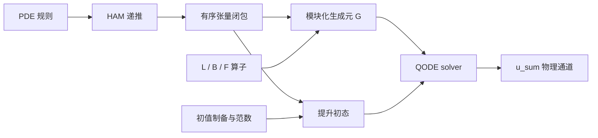

# 一般 QHAM 自动生成：PDE → HAM → QCL → QODE

QHAM 生成器将规则化 PDE、有限阶 HAM 推导和量子适配线性化连接到 QODE 输入。先阅读[数学推导](../reference/qham-derivation.md)，再按本章提供网格、系数与初态。构造依据是 [QHAM 论文](https://arxiv.org/html/2411.06759v2)。

这里的“二次线性化”是 secondary linearization，即对 HAM 变形方程再做一次量子适配线性化。程序同时支持规则内的二次、三次及更高有限次数，不先把高次非线性截成二次项。

## 1. “一般性”的明确范围

输入是自治的一阶时间演化 PDE 系统。允许：

- 任意有限分量和有限空间维；
- 未知场及其空间导数的有限多项式；
- 已知空间系数、已知强迫及其空间导数；
- 对完整单项式施加外层空间导数；
- 任意非负 HAM 截断阶 m，受显式生成预算和当前量子接口位宽限制约束。

例如：

```python
from pyqecclang.applications.qham import Field, Known, PolynomialPDE, QHAMPlan

# 声明两个未知场 u、v：各自是一个单项式原子，参与多项式运算。
u, v = Field("u"), Field("v")
# 用普通 Python 运算符书写方程右端：u.d("x", 2) 是二阶空间导数，
# u*u.d("x") 是二次对流项，Known("f") 是按名字引用的已知强迫数据。
# from_equations 会校验并冻结成不可变项集合，同时拆出 L/F/B 端口。
pde = PolynomialPDE.from_equations({
    "u": 0.1*u.d("x", 2) - u*u.d("x") + Known("f"),
    "v": -0.3*v + 0.2*u*v - 0.1*v**3,
}, axes=("x",), label="coupled_flow")

# HAM 截断阶 m=3：plan 只保存 PDE 和阶数，块闭包惰性生成，不物化矩阵。
plan = QHAMPlan(pde, order=3)
```

未知场的除法、超越函数、未消去的压力约束、一般隐式时间方程和时间依赖绑定不在首批规则内。它们不能仅改一个标签就被当成同一种已实现算法。时变 eta/L/f/B 的数学位置在推导中保留，但当前 QODE 组装要求自治绑定。

外导数保留为算子作用，例如 (u*u).d("x") 在离散化后表示 D_x 作用于同点乘积。程序没有偷偷把它改成 2*u*D_x(u)，因为有限差分一般不满足精确 Leibniz 恒等式。带外导数的非线性表达式目前不能继续作为乘积因子；这种写法需要显式改写为允许的单项式规则或提供多线性端口。

初值、边界和空间离散化由绑定提供。形式 PDE 推导本身不替用户选择边界条件，也不证明问题适定。

## 2. 自动推导到底生成什么

入口 [pde.py](../api/applications/qham/pde.rst) 将表达式拆成已知线性映射：

```text
u' = f + L u + sum_tau B_tau(u,...,u).
```

L 包含全部一次项，F 表示 f 的向量注入，每个非线性单项式形成一个多线性 B_tau。端口包含 PDE 系数；例如 Burgers 的 B 包含负号，KdV 的 B 包含 -6，不能只绑定一个没有这些系数的裸乘法。

[linearization.py](../api/applications/qham/linearization.rst) 自动生成：

1. 各阶 Ui 的 HAM 递推，使用 -eta(1+eta)^(i-1-l) 权重；
2. 有序张量字 Y_(a0,...,ak-1) 及其线性耦合；
3. 物理输出块 u_sum=sum(Ui)；
4. 非零强迫需要的常量分量 one；
5. 块的维数、偏移、索引排名/反排名和逐行算子规则。

最高非线性次数 D 对应的有限闭包取

```text
max(1,D-1)*sum(a_j)+len(a) <= max(1,D-1)*m+1.
```

闭包中的张量秩有限，非线性替换使 HAM 阶数和严格下降。它精确表示**截断后的 HAM 系统**，没有再做一次 Carleman 高阶截断。高次 PDE 使用规范闭包超集，可能包含冗余但闭合的变量。

QHAMPlan 是惰性对象：只保存 PDE 和 m。二次无强迫、m=20 时可描述 2^21 个函数块，而无需把这些块全部写入 JSON。row_terms、offset 和 locate 可单独查询。显式导出超过预算时，计划仍然有效，不会被伪装成已经展开完成的线路。

## 3. 两层可序列化表示



| 表示 | 作用 | 是否含量子门 |
|---|---|---|
| PDE 0.1 | 字段、空间轴、单项式、已知系数和内外导数 | 否 |
| QCL plan 0.1 | PDE＋HAM 阶数，以及确定的有限闭包规则 | 否 |
| RIR 0.3 | 实际寄存器、Call、控制、矩形窗口、工作位和 BE 组合 | 是，模块调用继续保留 |

格式见 [PDE Schema](../reference/schemas/pde.schema.json) 和 [QCL Schema](../reference/schemas/qcl-plan.schema.json)。PDE/QCL 没有 Python callback；可从 JSON 重建。只在显式请求时生成 rows.json 或量子模块。

“数学函数自动量子编译”和这里的 PDE 构造面有不同对象：compile_function 对基态寄存器中的数值做可逆计算；Field 表达式描述的是待求场及其幅度编码。不能把一个 out-of-place 数值函数电路直接当作对量子振幅施加非线性 PDE。QHAM 通过扩大线性状态空间处理后者。

## 4. 如何降低到 register-level 量子模块

实现见 [quantum.py](../api/algorithms/qham.rst) 和 [stencils.py](../api/applications/qham/stencils.rst)。

每个端口都用矩形线性映射解释：

| 端口 | 输入 | 输出 |
|---|---|---|
| L | V | V |
| B_tau | V 的 r 重张量积 | V |
| F | 标量常量空间 | V |

它们用补齐后的 BE 承载，alpha 和辅助位数由具体实现给出。QCL 将这些端口放在指定张量位置，其他坐标作恒等映射；强迫通过插入新坐标作用，非线性通过收缩多个坐标作用。

矩形块必须同时检查输入和输出窗口。全局布局不是等宽块布局，输入/输出的零填充也不能溢出到相邻块。程序使用可逆地址平移、坐标置换和两个窗口失败旗标实现嵌入。

周期网格的普通结构化实现包括：

- 有限差分导数由少量可逆移位及 LCU 组成；
- 分量选择由输入分量投影和输出分量编码实现；
- 同点乘积通过空间坐标 XOR、对角条件和矩形收缩实现；
- 外导数在收缩之后作用；
- 已知系数使用对角乘法 BE，当前普通门版本有显式词数预算。

这条路径不物化 N^r×N^r 的基础端口矩阵，更不物化整个提升矩阵。另有 gate_bindings，专门把很小的基础端口物化后用于对照；它不是一般路径。

例子：

```python
from pyqecclang.applications.qham import Grid, Discretization, structured_fd_bindings, qham_input_model

# 一维周期网格：4 个格点、间距 1.0；地址宽 2 位，导数用中心差分加周期回绕。
grid = Grid(("x",), (4,), (1.0,), boundary="periodic")
# 把 PDE 和网格接起来；第二个参数为每个 Known 名字提供覆盖全网格的数据，
# 缺表或长度不符会在这里报错（数据所有权在此刻由宿主决定）。
space = Discretization(pde, grid, {"f": [0.05, 0.0, -0.05, 0.0]})
# 把各分量初值嵌入完整 2^width 维振幅向量；必须覆盖全部未知场。
u_in = space.encode_fields({
    "u": [0.1, 0.2, 0.0, -0.1],
    "v": [0.0, 0.1, 0.0, -0.1],
})
# 唯一编译电路的一步：每个端口变成移位 LCU + 对角系数 + 矩形收缩的 BE，
# 初值变成门级制备，范数被记录；不物化 N^r×N^r 端口矩阵。
bindings = structured_fd_bindings(space, u_in)
# 按 plan 闭包装配提升后的线性生成元 BE 与提升初态，返回带 solve /
# dissipative_shift 适配器的输入模型；eta 在此代入同伦权重。
model = qham_input_model(plan, bindings, eta=-0.4)
```

参考差分支持周期和零延拓 Dirichlet；结构化移位实现当前要求各轴长度为二次幂的周期网格。其他离散化、边界或已知系数实现可通过同样的端口绑定提供。物理坐标的解释属于离散化层，QODE 只消费 V 上的线性数据。

## 5. 初态不能逐块随便归一化

设 r=||u_in||。提升初态只有 u_sum、全零字和可选 one 分量非零。全零 k 重张量字的范数为 r^k，必须保留这些相对权重：

```text
initial weights:  r, r, r^2, ..., r^K, [1 if forcing].
```

程序先按这些范数准备分支标签，在相应目标区间调用初始态制备 oracle，再从地址区间反算标签。调用的都是可重复、可受控的制备操作，不是复制一个只给定一次的未知量子态。初值 oracle 的相干相位也必须与所表示的经典向量一致。

每次对已知零输入的制备都复净其 work，因此同一段工作寄存器可以顺序复用。标签与其他工作位在成功制备后为零，公共 StatePreparation 接口仍是 target/work。初始整体范数以 log_initial_norm 记录，生成时使用缩放后的权重避免直接对大幂求和。

若 u_in=0 且有强迫，初态只需 one 分量。若没有强迫，零初态对应零解，不存在需要制备的非零归一化向量。

这里的范数是所选离散向量的 Euclidean 范数。若采用带网格权重的 L2 表示，必须相应调整端口和初值编码，不能只修改 initial_norm。若用 u=s*v 缩放物理变量，则 r 次项系数变为 s^(r-1) 倍、强迫变为 f/s，最终物理结果乘回 s；程序不会仅为获得较好成功率而偷偷归一化原 PDE。

## 6. 进入 QODE 的 input model

QHAMInputModel 包含生成元 BE、提升初态制备、原始状态宽度、同伦参数、初始范数和物理输出窗口。求解对象是

```text
Y' = G Y,   Y(0) = Y_in,
```

其中非齐次强迫已经通过常量分量齐次化。它不是直接把 G 当作一个需要求逆的 QLSS 矩阵；若 QODE solver 再构造时间离散线性系统，那个系统需要它自己的输入与谱假设。

```python
from functools import partial
from pyqecclang.algorithms.ode import linear_qode
from pyqecclang.algorithms.hamiltonian import taylor_hamiltonian

# 按名字选择求解器族（schrodingerization），并把 Hermitian 分支模拟核
# 作为普通参数注入：partial 固定 degree=1 的截断 Taylor 核。
# 换族或换核只改这一行，上面的输入模型不动。
qode = linear_qode(
    "schrodingerization",
    hamiltonian_function=partial(taylor_hamiltonian, degree=1),
)
# 在 t=0.01 求解：消耗生成元 BE 与提升初态，后选物理输出块，
# 返回带 plan/范数/待办项属性的 state oracle。
solution = model.solve(qode, 0.01)
# 取出其中的 RIR Program，用于序列化、导出或后端执行。
program = solution.operation.program()
```

返回结果选择第一个 N 维物理块，因此是归一化的截断 HAM 和。物理幅值仍需要所选 QODE solver 的范数恢复信息。当前 finite Taylor QODE 提供另一条不要求 Hermitian/耗散的普通候选，用来打通门级执行与对照；它不代表高效最优 QODE 算法。

### LCHS / CBMD 的额外前提

提升后的 G 通常非 Hermitian、非正规，强迫增广还会产生零模。不能直接假设它满足 LCHS/CBMD 的耗散前提。

实现提供显式整体移位：

```text
G_shift = G - mu*I,  mu >= alpha_G >= ||G||.
Y_shift(t) = exp(-mu*t) Y(t).
```

于是 -G_shift 的 Hermitian 部分非负。可调用 model.dissipative_shift()，再接入 LCHS/CBMD。结果保存 growth_shift*t 作为整体幅值恢复的对数因子。该操作保持归一化方向，但可能显著影响成功概率和成本，不是免费的性能优化。

### 稀疏输入不是从 BE 自动恢复的

QCL 的惰性行规则可以配合基础差分模板查询行和元素。Discretization.qcl_row/qcl_entry 是可审阅的经典参考，不是已经完成的可逆 quantum oracle。它们没有通过扫描整张矩阵获得结果。

如果选择稀疏输入型 QODE solver，需要另外提供满足其约定的基础稀疏访问及对应可逆实现。尤其强迫注入可产生稠密列；“行规则很稀疏”并不保证满足 CKS 的双边稀疏假设。这与 [QFVM 的输入模型审查](qfvm.md) 是同一条设计原则。

## 7. 保留未完成的实现

有两种开放层级：

1. 用 QHAMBindings.declare 声明 L、F、B_tau、初始态等基础 oracle，再生成 G 和整个 QODE 调用。它们可以逐个绑定。
2. 用 open_qham_input 保留整个 G 的 BE 为未完成模块，同时在属性中保存完整 QCL plan。初态仍可结构化生成。

第二种形式适合还没有高效全局 oracle 实现或超出显式块预算的情况。body=None 明确表示未完成，不会用空线路冒充实现。alpha、信号位和具体形状仍须实例化。

更换端口算法若改变 alpha 或辅助位数，应从同一数学 plan 重新生成上层 RIR。只有保持实例化签名/alpha 时，才适合在已有 IR 上晚绑定。

## 8. 自动推导小程序

```bash
# 内置案例
python -m pyqecclang.applications.qham --example burgers --order 3 \
  --eta=-0.4 --state-width 2 -o out/qham-general/my-derivation

# 任意符合 PDE 0.1 Schema 的输入
python -m pyqecclang.applications.qham my-pde.json --order 4 \
  --eta=-0.6 --state-width 3 -o out/my-qham

# 大阶数只查询一个块行，不枚举整个系统
python -m pyqecclang.applications.qham my-pde.json --order 20 \
  --row 0,1 --max-blocks 0 -o out/my-qham-row

# 重建本文五组完整案例
PYTHONPATH=src .venv/bin/python tools/build_general_qham.py
```

输出包括 pde.json、qcl-plan.json、rows.json、derivation.md 和 qode-input.json。量子案例还包含开放/闭合 RIR、模块化 OriginIR、Toffoli/U3/CZ 描述、端口绑定规格和数学验证记录。完整 Python 示例见 [general_qham.py](../../examples/general_qham.py)。

## 9. 验证与实现边界

| 案例 | HAM 阶数 | 非线性次数 | 提升维数 | 函数块数 |
|---|---:|---:|---:|---:|
| 强迫 Burgers | 2 | 2 | 129 | 9 |
| KdV | 3 | 2 | 628 | 16 |
| 强迫三次反应 | 2 | 3 | 101 | 14 |
| 双分量耦合系统 | 2 | 2 | 129 | 9 |
| 二维向量 Burgers | 2 | 2 | 35,968 | 8 |

这些是对应 PDE 家族的构造案例，不声称逐项复现论文图中的参数和边界条件。五组都使用结构化端口，不物化全局矩阵。独立的 HAM 递推、张量链式法则与生成的线性作用之间，见证残差约为 1e-16 或更小。它们检验的是代数生成，不是原始 PDE 的收敛误差。m=1 无强迫还与此前特例的实际 BE 角块做了回归。

真实 PySparQ 已执行多分量非线性端口、含强迫的二阶生成元和完整的小型 QHAM→有限 Taylor QODE→物理输出链；实际 OriginIR 解析器消费了组合描述。Schrödingerization 和经过显式耗散移位的 CBMD 也已完成输入组装。证据见 [验证记录](../archive/qham-general-validation.json)。

仍未完成：自动选择收敛的 h/m、HAM/PDE 收敛认证、时间依赖 QODE 适配、IQHAM 外层重启、完整范数/幅度估计和大规模性能认证。显式 BE lowering 会枚举块耦合，成本可随 m 组合增长；惰性 plan 和逐行算法为更高效 oracle 留出边界，但不能据此声称已经达到论文的查询复杂度。当前 BE 的单个 target/work 包装还受 64 位限制，超出时需保持开放或扩展该接口。

这套实现展示的是语言的表达与组装能力：PDE、阶数、分量或非线性次数改变时，同一套规则自动推导线性系统并生成可组合量子模块；无需为每个案例重新手写 QHAM 线路。

## 10. 数值验证

2026-09-16 的论文级数值验证（`tests/verification/verify_qham_qfvm.py`，真实后端无替身）从数值上确认了本章各构造环节：

- **线性化代数**：生成的 QCL 提升生成元经真实后端执行，其 signal-0 矩阵块与独立经典参考（`applications/qham/reference.py`）逐元素一致，结构化端口 1.46e-17、谱嵌入端口 7.96e-18；四种后端路径（内置参考、PySparQ RIR、PySparQ 适配器、UniQC 态向量）两两偏差 8.67e-18。
- **同伦步**：修正权重 −η(1+η)ᵖ 与物理权重 1−(1+η)ᵖ 逐点精确；行规则作用与独立链式法则残差 1.39e-17（含强迫 Burgers 实例）；HAM 部分和在 Riccati 实例上以平均收缩因子 0.604（η=−0.4）与 0.208（η=−0.8）收敛到解析解，与收缩映射理论值 |1+η|（0.6 与 0.2）吻合。
- **初态**：提升初态保持张量字相对范数 r, r, r², …，逐振幅误差 1.11e-16，`log_initial_norm` 与直接构造一致，工作位复净。
- **输入模型可替换性**：同一问题在结构化端口、谱嵌入端口、QRAM 角表系数三种输入模型下生成元矩阵一致——前两者 1e-17 量级，QRAM 角表路径 5.99e-05，在声明的角量化界 α·π/2^angle_width（9.20e-03）之内；QRAM 系数编码的逐地址振幅误差 2.15e-03（界 6.14e-03）。
- **求解链**：有限 Taylor QODE 端到端（BE 生成元 + 提升初态 + 物理块选取）对照经典 (I+tG)Y_in，两种输入模型各 1.11e-16；显式耗散移位 G−μI 在完整 2ʷ 空间的全矩阵误差 5.70e-17。

仍属求解器一侧的收敛认证、η/m 自动选择与大规模性能不在本次验证范围（见第 9 节）。复现命令与完整指标见[算法页数值验证](algorithms/qham.md#数值验证)与 `out/verification/qham_qfvm.json`。

## 11. QRAM 数据路径逐行讲解

本节针对第 4 节的已知系数项（`Known` 数据），逐行讲清同一条 open 程序如何在"系数烧进门里"与"系数留在 QRAM 角表"两种实现之间切换。源码：`applications/qham/stencils.py`；端到端示例：`examples/input_models.py` 的 QHAM 行。

### 11.1 门实现：`coefficient_encoding`

```python
values = [discretization.known_product(monomial, row) if row < grid.size else 0j
          for row in range(1 << width)]     # 经典侧算出每个地址的对角值
alpha = max((abs(v) for v in values), default=0)
for address, value in enumerate(values):
    with b.control(b["target"], address):   # 按地址受控的分支
        b.ry(b["signal"], 2 * math.acos(min(1, abs(value) / alpha)))
        if value:
            b.global_phase(cmath.phase(value))   # 复系数走全局相位
```

逐行：对角块编码的角块约定是 `D_jj = alpha·cos(theta_j/2)`——每个地址一个受控 RY，旋转角由 `|value|/alpha` 反余弦给出；复相位用 `gphase` 分支写入。注意 `values` 表被**编译进了控制字**：换一批系数就是换一段电路。超过 `max_words`（默认 4096）时此实现直接报错，要求改绑 QRAM 或自定义系数 BE。

### 11.2 QRAM 实现：`qram_coefficient_encoding`

```python
values = [...]                              # 同一张经典值表
if any(v.imag for v in values):
    raise ValidationError("QRAM 角编码的系数数据必须为实数")
alpha = max((abs(v.real) for v in values), default=0)
db = abstract_database(_name("coefficient_angles", values), width, angle_width)
return diagonal_block_encoding(db, alpha=alpha)
```

与门版本共用同一合同（target 为空间位、alpha 相同），差别只有两步：**开放**一个"地址宽 = 空间位宽、数据宽 = angle_width"的 XOR 数据库槽，再由 `diagonal_block_encoding` 把它组装成对角 BE（内部：查角字 → 按位受控 RY 合成，机制与第 4 节结构化端口一致）。数据不进门：程序此时仍是 open 的，槽位名里带值表的内容哈希（`_name`），闭合前后 α 声明不变。代价是两条明确的约束：只接受**实系数**（复相位没有对应编码），以及角量化引入不超过 `alpha·pi/2**angle_width` 的幅值误差。

### 11.3 运行时角表：`qram_coefficient_memory`

```python
alpha = max((abs(v.real) for v in values), default=0)
step = 2 * math.pi / (1 << angle_width)
return {
    address: round(2 * math.acos(min(1, max(-1, v.real / alpha))) / step) % (1 << angle_width)
    for address, v in enumerate(values)
}
```

逐行：α 与 11.2 声明的同源（换数据表必须同步 α 与谱声明）；每个地址的角字 = θ 除以步进 `2π/2^aw` 后四舍五入取模。这个量化界就是第 10 节"QRAM 角表路径 5.99e-05，界 9.20e-03"那条验证的来源。

### 11.4 提升初态：`qram_state_angles`

初态角树与 QFVM 的 RHS 符号残差树是**同一机制**（同一 `qram_state_prep` 电路：每层查一个内部节点角字、按位合成 RY、反查询复净，共 `2·width` 次查询）。差别只在权重：这里的分支权重是各提升块的相对范数（第 5 节的 r, r, r², …），同样要求非负实幅度：

```python
qram_state_angles(profile, 8)   # {树节点: 角字}，编址 (1<<depth)-1+prefix
```

### 11.5 端到端：一条 open 程序、两种闭合

```python
profile = [0.1, 0.2, 0.15, 0.05]   # QRAM 角表只接受非负实幅度
qinitial = space.encode_fields({"u": profile})
# 换编码器：structured_fd_bindings 的 coefficient_encoder 钩子接 QRAM 版本（角字 8 位）。
encoder = partial(qram_coefficient_encoding, angle_width=8)
open_bindings = structured_fd_bindings(space, qinitial, coefficient_encoder=encoder)
# 初值也换成开放槽（宽度 + 10 位工作区）：闭合时可绑门制备或 QRAM 制备。
open_bindings = QHAMBindings(
    open_bindings.state_width, open_bindings.ports,
    abstract_state_prep("QhamInitial", open_bindings.state_width, 10),
    open_bindings.initial_norm,
)
model = qham_input_model(plan, open_bindings, eta=-0.4)
state = model.solve(schrodinger, 0.01)
# 从 open 程序中找出角库槽：除初值外唯一的未解析声明。
db_slot = [r.name for r in unresolved(state.operation.program()) if r.name != "QhamInitial"][0]
# 找到方程里含 Known 的单项式，经典侧算出它的角字表并补零到全地址域。
(forcing_monomial,) = (t.monomial for p in space.pde.ports for t in p.terms if t.monomial.known)
angle_words = qram_coefficient_memory(space, forcing_monomial, angle_width=8)
word_table = [angle_words.get(address, 0) for address in range(4)]
```

两种闭合（程序文本不变，只换绑定字典）：

```python
# 闭合 A（门）：把同一批角字烧进真值表数据库。
{db_slot: gate_database(2, 8, word_table).operation,
 "QhamInitial": gate_state_prep(profile, work_width=10).operation}
# 闭合 B（QRAM）：槽位绑 QRAM 库，数据运行时给。
{db_slot: Binding(qram_database(2, 8).operation, {"table": "coeff_angles"}),
 "QhamInitial": Binding(qram_state_prep(2, 8).operation, {"angles": "initial_angles"})}
# 闭合 B 的配套内存表：
{"coeff_angles": word_table, "initial_angles": qram_state_angles(profile, 8)}
```

三个要点：

1. **两种闭合编码同一批数据**。门真值表存的就是 QRAM 表里那些角字，所以两条路径逐位一致（第 10 节验证）；相对精确系数的唯一近似是角量化。
2. **α 随数据走**。`qram_coefficient_memory` 的 α 与编码器声明同源；改数据表必须同步 α、谱声明与初始范数，否则闭合检查会拒绝。
3. **接口约束如实记录**。非负实幅度是当前 QRAM 态制备/角表实现的接口约束，不是数学限制；带符号数据要像 QFVM 那样配独立符号库（对照其 `rhs_sign` 的 Z 反冲），属于另一条实现路径。
