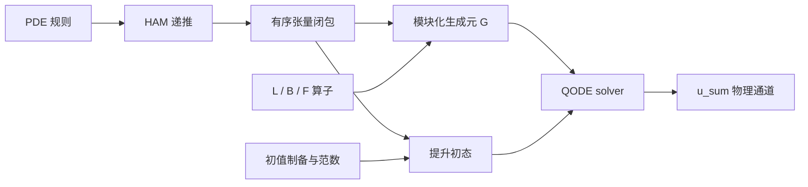

# 一般 QHAM 自动生成：PDE → HAM → QCL → QODE

QHAM 生成器将规则化 PDE、有限阶 HAM 推导和量子适配线性化连接到 QODE 输入。先阅读[数学推导](../reference/qham-derivation.md)，再按本章提供网格、系数与初态。构造依据是 [QHAM 论文](https://arxiv.org/html/2411.06759v2)。

这里的“二次线性化”是 secondary linearization，即对 HAM 变形方程再做一次量子适配线性化。程序同时支持规则内的二次、三次及更高有限次数，不先把高次非线性截成二次项。

## 1. “一般性”的明确范围

输入是自治的一阶时间演化 PDE 系统。允许：

- 任意有限分量和有限空间维；
- 未知场及其空间导数的有限多项式；
- 已知空间系数、已知强迫及其空间导数；
- 对完整单项式施加外层空间导数；
- 任意非负 HAM 截断阶 m，受显式生成预算和当前量子接口位宽限制约束。

例如：

```python
from pyqecclang.applications.qham import Field, Known, PolynomialPDE, QHAMPlan

u, v = Field("u"), Field("v")
pde = PolynomialPDE.from_equations({
    "u": 0.1*u.d("x", 2) - u*u.d("x") + Known("f"),
    "v": -0.3*v + 0.2*u*v - 0.1*v**3,
}, axes=("x",), label="coupled_flow")

plan = QHAMPlan(pde, order=3)
```

未知场的除法、超越函数、未消去的压力约束、一般隐式时间方程和时间依赖绑定不在首批规则内。它们不能仅改一个标签就被当成同一种已实现算法。时变 eta/L/f/B 的数学位置在推导中保留，但当前 QODE 组装要求自治绑定。

外导数保留为算子作用，例如 (u*u).d("x") 在离散化后表示 D_x 作用于同点乘积。程序没有偷偷把它改成 2*u*D_x(u)，因为有限差分一般不满足精确 Leibniz 恒等式。带外导数的非线性表达式目前不能继续作为乘积因子；这种写法需要显式改写为允许的单项式规则或提供多线性端口。

初值、边界和空间离散化由绑定提供。形式 PDE 推导本身不替用户选择边界条件，也不证明问题适定。

## 2. 自动推导到底生成什么

入口 [pde.py](../api/applications/qham/pde.rst) 将表达式拆成已知线性映射：

```text
u' = f + L u + sum_tau B_tau(u,...,u).
```

L 包含全部一次项，F 表示 f 的向量注入，每个非线性单项式形成一个多线性 B_tau。端口包含 PDE 系数；例如 Burgers 的 B 包含负号，KdV 的 B 包含 -6，不能只绑定一个没有这些系数的裸乘法。

[linearization.py](../api/applications/qham/linearization.rst) 自动生成：

1. 各阶 Ui 的 HAM 递推，使用 -eta(1+eta)^(i-1-l) 权重；
2. 有序张量字 Y_(a0,...,ak-1) 及其线性耦合；
3. 物理输出块 u_sum=sum(Ui)；
4. 非零强迫需要的常量分量 one；
5. 块的维数、偏移、索引排名/反排名和逐行算子规则。

最高非线性次数 D 对应的有限闭包取

```text
max(1,D-1)*sum(a_j)+len(a) <= max(1,D-1)*m+1.
```

闭包中的张量秩有限，非线性替换使 HAM 阶数和严格下降。它精确表示**截断后的 HAM 系统**，没有再做一次 Carleman 高阶截断。高次 PDE 使用规范闭包超集，可能包含冗余但闭合的变量。

QHAMPlan 是惰性对象：只保存 PDE 和 m。二次无强迫、m=20 时可描述 2^21 个函数块，而无需把这些块全部写入 JSON。row_terms、offset 和 locate 可单独查询。显式导出超过预算时，计划仍然有效，不会被伪装成已经展开完成的线路。

## 3. 两层可序列化表示



| 表示 | 作用 | 是否含量子门 |
|---|---|---|
| PDE 0.1 | 字段、空间轴、单项式、已知系数和内外导数 | 否 |
| QCL plan 0.1 | PDE＋HAM 阶数，以及确定的有限闭包规则 | 否 |
| RIR 0.3 | 实际寄存器、Call、控制、矩形窗口、工作位和 BE 组合 | 是，模块调用继续保留 |

格式见 [PDE Schema](../reference/schemas/pde.schema.json) 和 [QCL Schema](../reference/schemas/qcl-plan.schema.json)。PDE/QCL 没有 Python callback；可从 JSON 重建。只在显式请求时生成 rows.json 或量子模块。

“数学函数自动量子编译”和这里的 PDE 构造面有不同对象：compile_function 对基态寄存器中的数值做可逆计算；Field 表达式描述的是待求场及其幅度编码。不能把一个 out-of-place 数值函数电路直接当作对量子振幅施加非线性 PDE。QHAM 通过扩大线性状态空间处理后者。

## 4. 如何降低到 register-level 量子模块

实现见 [quantum.py](../api/algorithms/qham.rst) 和 [stencils.py](../api/applications/qham/stencils.rst)。

每个端口都用矩形线性映射解释：

| 端口 | 输入 | 输出 |
|---|---|---|
| L | V | V |
| B_tau | V 的 r 重张量积 | V |
| F | 标量常量空间 | V |

它们用补齐后的 BE 承载，alpha 和辅助位数由具体实现给出。QCL 将这些端口放在指定张量位置，其他坐标作恒等映射；强迫通过插入新坐标作用，非线性通过收缩多个坐标作用。

矩形块必须同时检查输入和输出窗口。全局布局不是等宽块布局，输入/输出的零填充也不能溢出到相邻块。程序使用可逆地址平移、坐标置换和两个窗口失败旗标实现嵌入。

周期网格的普通结构化实现包括：

- 有限差分导数由少量可逆移位及 LCU 组成；
- 分量选择由输入分量投影和输出分量编码实现；
- 同点乘积通过空间坐标 XOR、对角条件和矩形收缩实现；
- 外导数在收缩之后作用；
- 已知系数使用对角乘法 BE，当前普通门版本有显式词数预算。

这条路径不物化 N^r×N^r 的基础端口矩阵，更不物化整个提升矩阵。另有 gate_bindings，专门把很小的基础端口物化后用于对照；它不是一般路径。

例子：

```python
from pyqecclang.applications.qham import Grid, Discretization, structured_fd_bindings, qham_input_model

grid = Grid(("x",), (4,), (1.0,), boundary="periodic")
space = Discretization(pde, grid, {"f": [0.05, 0.0, -0.05, 0.0]})
u_in = space.encode_fields({
    "u": [0.1, 0.2, 0.0, -0.1],
    "v": [0.0, 0.1, 0.0, -0.1],
})
bindings = structured_fd_bindings(space, u_in)
model = qham_input_model(plan, bindings, eta=-0.4)
```

参考差分支持周期和零延拓 Dirichlet；结构化移位实现当前要求各轴长度为二次幂的周期网格。其他离散化、边界或已知系数实现可通过同样的端口绑定提供。物理坐标的解释属于离散化层，QODE 只消费 V 上的线性数据。

## 5. 初态不能逐块随便归一化

设 r=||u_in||。提升初态只有 u_sum、全零字和可选 one 分量非零。全零 k 重张量字的范数为 r^k，必须保留这些相对权重：

```text
initial weights:  r, r, r^2, ..., r^K, [1 if forcing].
```

程序先按这些范数准备分支标签，在相应目标区间调用初始态制备 oracle，再从地址区间反算标签。调用的都是可重复、可受控的制备操作，不是复制一个只给定一次的未知量子态。初值 oracle 的相干相位也必须与所表示的经典向量一致。

每次对已知零输入的制备都复净其 work，因此同一段工作寄存器可以顺序复用。标签与其他工作位在成功制备后为零，公共 StatePreparation 接口仍是 target/work。初始整体范数以 log_initial_norm 记录，生成时使用缩放后的权重避免直接对大幂求和。

若 u_in=0 且有强迫，初态只需 one 分量。若没有强迫，零初态对应零解，不存在需要制备的非零归一化向量。

这里的范数是所选离散向量的 Euclidean 范数。若采用带网格权重的 L2 表示，必须相应调整端口和初值编码，不能只修改 initial_norm。若用 u=s*v 缩放物理变量，则 r 次项系数变为 s^(r-1) 倍、强迫变为 f/s，最终物理结果乘回 s；程序不会仅为获得较好成功率而偷偷归一化原 PDE。

## 6. 进入 QODE 的 input model

QHAMInputModel 包含生成元 BE、提升初态制备、原始状态宽度、同伦参数、初始范数和物理输出窗口。求解对象是

```text
Y' = G Y,   Y(0) = Y_in,
```

其中非齐次强迫已经通过常量分量齐次化。它不是直接把 G 当作一个需要求逆的 QLSS 矩阵；若 QODE solver 再构造时间离散线性系统，那个系统需要它自己的输入与谱假设。

```python
from functools import partial
from pyqecclang.algorithms.ode import linear_qode
from pyqecclang.algorithms.hamiltonian import taylor_hamiltonian

qode = linear_qode(
    "schrodingerization",
    hamiltonian_function=partial(taylor_hamiltonian, degree=1),
)
solution = model.solve(qode, 0.01)
program = solution.operation.program()
```

返回结果选择第一个 N 维物理块，因此是归一化的截断 HAM 和。物理幅值仍需要所选 QODE solver 的范数恢复信息。当前 finite Taylor QODE 提供另一条不要求 Hermitian/耗散的普通候选，用来打通门级执行与对照；它不代表高效最优 QODE 算法。

### LCHS / CBMD 的额外前提

提升后的 G 通常非 Hermitian、非正规，强迫增广还会产生零模。不能直接假设它满足 LCHS/CBMD 的耗散前提。

实现提供显式整体移位：

```text
G_shift = G - mu*I,  mu >= alpha_G >= ||G||.
Y_shift(t) = exp(-mu*t) Y(t).
```

于是 -G_shift 的 Hermitian 部分非负。可调用 model.dissipative_shift()，再接入 LCHS/CBMD。结果保存 growth_shift*t 作为整体幅值恢复的对数因子。该操作保持归一化方向，但可能显著影响成功概率和成本，不是免费的性能优化。

### 稀疏输入不是从 BE 自动恢复的

QCL 的惰性行规则可以配合基础差分模板查询行和元素。Discretization.qcl_row/qcl_entry 是可审阅的经典参考，不是已经完成的可逆 quantum oracle。它们没有通过扫描整张矩阵获得结果。

如果选择稀疏输入型 QODE solver，需要另外提供满足其约定的基础稀疏访问及对应可逆实现。尤其强迫注入可产生稠密列；“行规则很稀疏”并不保证满足 CKS 的双边稀疏假设。这与 [QFVM 的输入模型审查](qfvm.md) 是同一条设计原则。

## 7. 保留未完成的实现

有两种开放层级：

1. 用 QHAMBindings.declare 声明 L、F、B_tau、初始态等基础 oracle，再生成 G 和整个 QODE 调用。它们可以逐个绑定。
2. 用 open_qham_input 保留整个 G 的 BE 为未完成模块，同时在属性中保存完整 QCL plan。初态仍可结构化生成。

第二种形式适合还没有高效全局 oracle 实现或超出显式块预算的情况。body=None 明确表示未完成，不会用空线路冒充实现。alpha、信号位和具体形状仍须实例化。

更换端口算法若改变 alpha 或辅助位数，应从同一数学 plan 重新生成上层 RIR。只有保持实例化签名/alpha 时，才适合在已有 IR 上晚绑定。

## 8. 自动推导小程序

```bash
# 内置案例
python -m pyqecclang.applications.qham --example burgers --order 3 \
  --eta=-0.4 --state-width 2 -o out/qham-general/my-derivation

# 任意符合 PDE 0.1 Schema 的输入
python -m pyqecclang.applications.qham my-pde.json --order 4 \
  --eta=-0.6 --state-width 3 -o out/my-qham

# 大阶数只查询一个块行，不枚举整个系统
python -m pyqecclang.applications.qham my-pde.json --order 20 \
  --row 0,1 --max-blocks 0 -o out/my-qham-row

# 重建本文五组完整案例
PYTHONPATH=src .venv/bin/python tools/build_general_qham.py
```

输出包括 pde.json、qcl-plan.json、rows.json、derivation.md 和 qode-input.json。量子案例还包含开放/闭合 RIR、模块化 OriginIR、Toffoli/U3/CZ 描述、端口绑定规格和数学验证记录。完整 Python 示例见 [general_qham.py](../../examples/general_qham.py)。

## 9. 验证与实现边界

| 案例 | HAM 阶数 | 非线性次数 | 提升维数 | 函数块数 |
|---|---:|---:|---:|---:|
| 强迫 Burgers | 2 | 2 | 129 | 9 |
| KdV | 3 | 2 | 628 | 16 |
| 强迫三次反应 | 2 | 3 | 101 | 14 |
| 双分量耦合系统 | 2 | 2 | 129 | 9 |
| 二维向量 Burgers | 2 | 2 | 35,968 | 8 |

这些是对应 PDE 家族的构造案例，不声称逐项复现论文图中的参数和边界条件。五组都使用结构化端口，不物化全局矩阵。独立的 HAM 递推、张量链式法则与生成的线性作用之间，见证残差约为 1e-16 或更小。它们检验的是代数生成，不是原始 PDE 的收敛误差。m=1 无强迫还与此前特例的实际 BE 角块做了回归。

真实 PySparQ 已执行多分量非线性端口、含强迫的二阶生成元和完整的小型 QHAM→有限 Taylor QODE→物理输出链；实际 OriginIR 解析器消费了组合描述。Schrödingerization 和经过显式耗散移位的 CBMD 也已完成输入组装。证据见 [验证记录](../archive/qham-general-validation.json)。

仍未完成：自动选择收敛的 h/m、HAM/PDE 收敛认证、时间依赖 QODE 适配、IQHAM 外层重启、完整范数/幅度估计和大规模性能认证。显式 BE lowering 会枚举块耦合，成本可随 m 组合增长；惰性 plan 和逐行算法为更高效 oracle 留出边界，但不能据此声称已经达到论文的查询复杂度。当前 BE 的单个 target/work 包装还受 64 位限制，超出时需保持开放或扩展该接口。

这套实现展示的是语言的表达与组装能力：PDE、阶数、分量或非线性次数改变时，同一套规则自动推导线性系统并生成可组合量子模块；无需为每个案例重新手写 QHAM 线路。
