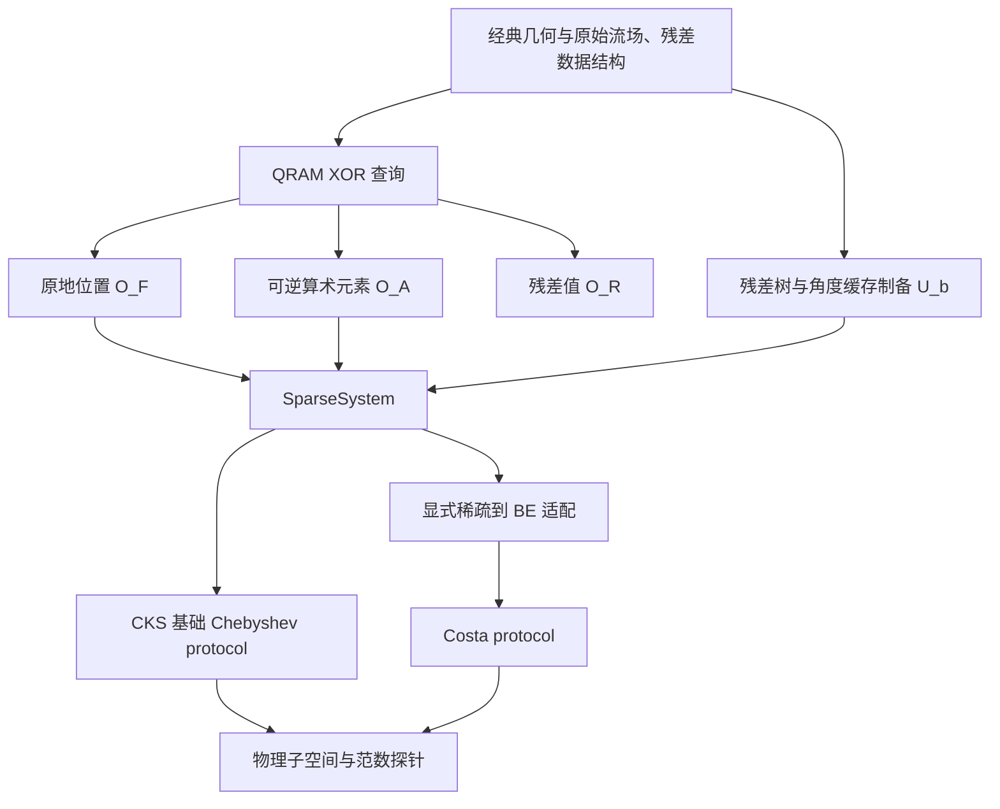

# QFVM 中替换 QLSS：输入模型、QRAM 数据结构与输出契约审查

审查日期：2026-09-09。本文对应本轮修正后的实现；被审查的基线是 pyqecclang 0.4.0 的 QFVM 路径。

## 结论

**基线没有正确实现跨输入模型的 QLSS 替换。** 原 roe_qfvm_step 先固定调用 roe_qfvm_block_encoding，再执行 qlss(be, rhs)。这只能替换接受相同 BE 接口的 Python 生成器。库中虽然已有 SparseAccess，它并没有成为 QFVM 暴露给 QLSS 的问题输入。

QFVM/CKS 的稀疏输入与 Costa 的 BE 输入属于不同抽象层，但并不互相排斥。可以把稀疏 oracle 显式转换成 BE，再交给 Costa；反过来，从任意 BE 恢复高效的稀疏位置和元素 oracle，一般没有这样的保证。**替换应发生在问题和 protocol 之间，并保留适配过程，不能把不同输入接口当成相同签名。**

本轮已经调整实现：同一个 QFVM 问题可以交给声明 sparse 输入的 CKS 基础路线，或声明 block_encoding 输入的 Costa 路线。它们保持相同的原始场量/几何/RHS 输入和物理输出坐标，辅助位和内部模块可以不同。数值算法的完整正确性尚未认证，因此这里证明的是输入适配和构造上的可替换性，不是两个求解器已经数值等价或都达到论文复杂度。

## 1. 三篇论文实际假设了什么

### QFVM

QFVM 的主要贡献是从经典流场与几何数据构造量子求解所需接口，并处理解的读出和局部更新。原文 III 的接口是矩阵元素 O_A、残差元素 O_b 和相关单元位置 O_l；IV 再通过残差平方和树得到归一化残差态。尤其应区分**残差值查询 O_b**与**制备 |b> 的操作**。[QFVM III–IV](https://arxiv.org/html/2102.03557v1#S3)

O_l 最初在单元层面描述邻接关系；应用到多守恒量的标量矩阵时，还需要加入分量索引。本文的一维三分量实现有三个相邻单元、九个结构槽位。槽位中允许出现数值为零的条目，这不等于把不同槽位都映射到同一个地址。

原文没有要求上层 QFVM 先提供 Costa walk，也没有给出此前文档所暗示的那条 T_L† S T_R 接口。块编码应属于所选 QLSS 的输入适配层。

### CKS

CKS 1.1 要求 Hermitian 稀疏矩阵的两种访问：位置接口把给定列的稀疏序号**原地**变成行索引；元素接口在任意两个坐标下 XOR 写入条目字。另外提供制备归一化 |b> 的 P_B。位置原地计算需要有效的逆映射；只实现保留序号的 XOR 查表，还不满足该接口。[CKS 1.1，式 (1)–(2)](https://arxiv.org/html/1511.02306#S1.SS1)

非 Hermitian 矩阵可以扩张为 Hermitian 系统，但此时需要原矩阵的行、列稀疏访问。CKS 4 的 walk 又引入按稀疏度缩放的矩阵；不能把其 walk 参数直接视为原矩阵的参数。基础 Chebyshev/LCU 路线与后面的 variable-time amplitude amplification 是不同的实现范围。[CKS 4](https://arxiv.org/html/1511.02306#S4)

### Costa

Costa 从 U_A 的 BE 和 U_b 的态制备出发，并使用受控 U_A、U_A†、U_b、U_b†。论文讨论了从稀疏输入得到 BE 的适配，因此使用 QFVM 的稀疏数据并不违反它的输入模型。需要转换的是接口及其归一化参数。[Costa 输入说明、IV 与 Appendix E](https://arxiv.org/html/2111.08152v1)

论文的规范化矩阵和库中“记录 alpha 的 BE”不能不加换算地混用。一般矩阵的 Hermitian 扩张与 walk 中的额外辅助结构也需要明确坐标约定。

| 内容 | QFVM 提供/构造 | CKS 消费 | Costa 消费 |
|---|---|---|---|
| 几何与原始流场 | 经典可更新、量子可查询数据 | 经位置/元素 oracle 访问 | 经稀疏→BE 适配访问 |
| 稀疏位置 | 单元邻接扩展到分量位置 | 原地位置操作及逆 | 不要求直接接收该接口 |
| 矩阵条目 | 由原始数据的可逆算术计算 | 条目 XOR 操作 | 适配后 U_A 的角块 |
| 右端 | 残差值、范数树、制备电路 | P_B | U_b 及其逆/控制 |
| 归一化解 | 尚需读出和恢复幅值 | 输出算法相关的成功分支 | 输出算法相关的成功分支 |

## 2. 必须分开的四层



1. **QRAM 资源**提供对任意叠加地址的可逆数据查询。它不自动提供幅度编码。
2. **经典可更新的数据结构**组织几何、原始场量、残差和树节点；它决定能否高效生成制备所需数据。
3. **Oracle 操作**具有具体的寄存器更新契约，例如原地置换、条目 XOR 和干净工作区的状态制备。
4. **Protocol**根据输入模型生成算法及适配器。它是普通 Python 生成器，RIR 中留下的是模块调用与资源绑定。

QFVM 原文另外假设 QRAM 的量子查询具有对数时间开销，经典访问/单点覆盖具有 RAM 能力。这些是资源模型的假设，不是写出 QRAMDECL 后语言就自动证明的硬件性质。[QFVM II.3](https://arxiv.org/html/2102.03557v1#S2.SS3)

## 3. 基线问题及本轮修正

| 基线问题 | 影响 | 本轮处理 |
|---|---|---|
| QFVM 固定输出 BE | 原生稀疏 QLSS 无法直接接入 | 新增 LinearSystem、SparseSystem、BlockSystem 和 QLSSProtocol |
| geometry XOR 查询被当成稀疏位置访问的替代品 | 没有 CKS 原地语义和逆映射 | 新增真正的 O_F，完整置换由九个位置的可逆换位补全 |
| Roe entry 只接受 source/row/col/band | 不是任意矩阵坐标 O_A | 新增 row/column/data 接口，稀疏域外返回零 |
| 三分量补到四分量后留有全零行列 | 扩张矩阵整体奇异 | 在补齐子空间添加正对角 padding_value |
| alpha 与 Costa kappa 相互独立 | 编码矩阵的逆谱界可能错误 | 用 alpha / sigma_min_lower 推导实际参数 |
| Costa 的 RHS 零态反射未包含 work | 一般酉扩张的投影对象不完整 | 同时反射 target 和 RHS work 的零态 |
| 只有 StateOracle 返回值 | 无法正确恢复 QFVM 更新量范数 | SolveResult 包含物理通道与独立矩阵范数探针 |
| 角树制备枚举全部 prefix | 查询数随数据长度增长 | 每一树层根据量子 prefix 形成地址并查询 |
| 局部更新复制全部 states/fluxes | 隐含 O(N) 经典开销 | 用局部暂存与原地提交更新受影响部分 |

历史 access.sparse_block_encoding 保留为旧目录中的候选描述，并已标记 legacy；新的 QFVM 路径不使用它。

## 4. 新 QFVM 稀疏输入如何实现

实现见 [qfvm_sparse.py](../api/applications/qfvm.rst)。

### 原地位置 oracle

公开接口是 column、index、work，其中 index 使用完整矩阵索引宽度。前九个 index 值映射到几何定义的九个不同位置；剩余输入通过完整置换扩张定义，逆操作由同一线路的 adjoint 给出。

实现只查询每列的九个结构位置，通过换位序列补全置换，没有要求 QRAM 存储整张 N×N 的置换表。其成本包含稀疏度和可逆比较/换位的开销；本轮没有将它宣传为免费的单位门操作。

### 任意坐标的元素 oracle

接口为 row、column、data。电路利用结构槽位找到相应源单元和分量，再调用自动编译的 Roe 数学函数。没有在经典侧预计算整张矩阵元素表。

结构域外条目为零；补齐坐标的对角为 padding_value。算术失效或溢出时，当前有限实现将该条目总化为零。因此谱假设应适用于**实际量化后的矩阵**，不能只针对理想连续 Jacobian。该数值策略及其物理影响仍待核验。

### Hermitian 扩张与物理通道

设原始有限矩阵为 M，实际右端为 r。物理坐标上使用

```text
D = [[0, M],
     [M^T, 0]],     b_D = [r, 0].

D^-1 b_D = [0, M^-1 r].
```

当前 QFVM 的数值是实数，所以转置即可；一般复数需要共轭转置。三分量到四分量产生的空坐标上另外放置 padding_value·I，右端在这些坐标上为零。这样不会人为引入全零特征子空间。物理 M 可逆以及量化后的谱界仍由问题方声明。

这同时给两条 solver 路线相同的问题。返回时统一选择扩张标志为 1 的物理通道；最后的 4N 坐标仍有用于表示 3N 物理量的空槽，经典读出须按坐标映射解释。

## 5. 稀疏到 BE 的适配不是类型转换

实现见 [sparse_models.py](../api/algorithms/sparse.rst)。当前正式适配专门支持实 Hermitian、非负对角的输入；QFVM 的上述扩张满足这种结构。一般稀疏矩阵不能仅设置相同位宽就使用该适配器。

适配器生成 CKS 类型的 T，再交换两侧坐标及两侧失败旗标，形成自伴酉扩张 T†ST。非零条目的成功幅度使用 sqrt(|entry|/amax)；负的非对角元素采用有向相位约定。两侧失败旗标的交换是必要部分，不能只交换索引。

若每行/列枚举 s 个不同结构位置，且 amax 确实约束元素幅值，则其角块为 D/alpha，alpha=s·amax。当前 QFVM 的 s=9。小字长的幅度转导提供普通门实现，超过 12 位保留显式待绑定 transducer；该数值实现的代价应计入成本。

本轮用含负非对角元素的 2×2 矩阵检查了角块与 alpha，并检查 walk 三次幂投影得到 T_3(D/alpha)。这类见证检查输入适配的符号和归一化，不构成所有矩阵/字长的证明。

### Costa 的参数换算

库的 BE 满足零信号角块为 D/alpha。Costa 实际看到的是 D_hat=D/alpha：

```text
sigma_min(D_hat) >= sigma_min_lower / alpha
encoded_inverse_bound = alpha / sigma_min_lower.
```

它一般不同于 cond(D)。例如 D=0.5 I 的条件数为 1，但若 alpha=2，编码矩阵的逆范数为 4。对于非 Hermitian 原矩阵，应使用奇异值界；不能普遍用特征值绝对值之比替代。

SpectralPromise 记录范数上界、最小奇异值下界及证据来源。它是调用者的声明，语言不证明该声明，也不在核心引入 eps。原来的低层 make_costa_qlss(...)(be,b) 仍供旧生成器使用，其 kappa 现在明确指编码矩阵的逆谱界；新的问题级入口会推导该参数。

## 6. 输出替换也需要契约

QFVM 最终要更新经典流场，需要 M^-1 r 的方向和范数。**Costa filtering 的成功率不能直接套用 CKS 逆算子 LCU 的归一化因子。** 两者的成功分支形成方式不同，仅返回归一化解态不能完成整个替换。

新 SolveResult 提供相同物理方向的状态接口，以及独立的 norm_probe。设求解后成功概率为 p_solver；在成功解上再应用矩阵 BE，测得求解和新 BE 信号同时成功的概率 p_joint。若输出方向确为归一化解，则

```text
p_joint / p_solver = ||D |x_hat>||^2 / alpha^2
||x|| = ||r|| / [alpha * sqrt(p_joint / p_solver)].
```

该构造对两种 solver 使用同一种归一化契约，额外查询成本也明确存在。生成的探针是量子模块；概率估计/幅度估计、相位约定、受控态制备的 tomography 和完整 CFD 外层更新仍是后续工作。已知 RHS 范数为零时，新的入口拒绝制备归一化 RHS，要求经典侧处理零更新。

## 7. QRAM 与 quantum data structure 的实际范围

QFVM 的输入不是一份未加工数组加上“有 QRAM”四个字。它需要几何、原始物理变量、残差值、平方范数树，以及这些数据之间的同步关系。

当前实现维护：

- 原始场量和几何 QRAM；
- 可查询的 rhs_values 和符号 bank；
- 经典平方范数树与根节点范数；
- 每个内部树节点的旋转角缓存 bank。

这是用经典可局部更新的角缓存实现 U_b 的一种具体细化，并没有声称原样实现了论文所有 P_R 树节点查询电路。角度按 RY 的半角约定从平方和推导：RY 参数为 2 acos sqrt(S_left/S_node)。残差值先量化，再共同用于值 bank、符号、树和角缓存。

对长度 2^n 的向量，新制备线路使用 2n 次角度 bank 查询（含反算），再加符号访问；原实现是 2(2^n−1) 次查询。若一次 QRAM 查询本身需 O(log N) 时间，查询次数与总查询时间应分别计算。

单点流场修改只重算相邻界面和受影响的树节点，已去掉整场复制。初始化和 snapshot/后端物化仍有线性开销。PySparQ 当前没有原生局部 QRAM 写入接口，变更 bank 仍需重新物化；这不能算成论文假设的常数时间物理写操作。修改 QRAM 内容后可复用同一结构的 IR，前提是元素界、谱声明和 RHS/树缓存仍然同步；改变 alpha 或寄存器布局需要重新生成。每段相干计算中的 QRAM 内容必须固定，P、P†、受控 P 及范数探针必须使用一致的数据版本。[QFVM II.3、IV](https://arxiv.org/html/2102.03557v1#S4)

## 8. 如何替换

```python
from pyqecclang import FixedFormat, SpectralPromise
from pyqecclang.applications.qfvm import roe_qfvm_inputs, roe_qfvm_problem, bind_qfvm
from pyqecclang.algorithms.qlss import CKSConfig, make_cks_qlss
from pyqecclang.algorithms.qlss import CostaConfig, make_costa_qlss

inputs = roe_qfvm_inputs(fmt=FixedFormat(6, 2), angle_width=6)
problem = roe_qfvm_problem(
    inputs,
    # 示例声明；真实问题应提供覆盖实际有限矩阵的谱界。
    spectrum=SpectralPromise(norm_upper=10, sigma_min_lower=0.5),
    amax=4,
    rhs_norm=1.0,
)

cks = make_cks_qlss(CKSConfig(order=2))(problem)
costa = make_costa_qlss(CostaConfig(steps=1))(problem)

cks_rir = bind_qfvm(cks.operation.program(), inputs)
costa_rir = bind_qfvm(costa.operation.program(), inputs)
```

同一个 problem 使用相同的数据 oracle。CKS protocol 消费 SparseSystem；Costa protocol 请求 BlockSystem，触发稀疏→BE 适配。没有反向的 BE→稀疏自动转换。

本轮四单元实例中，两条路线均有 alpha=36、编码逆谱界 72、物理输出宽度 4；CKS 与 Costa 的 signal 宽度分别为 20 和 25。**替换 protocol 后应重新生成上层寄存器布局**，不能把不同辅助位签名直接塞进已经闭合的 RIR。重新生成仍保留模块和 oracle 边界，不要求整体展开。

原 roe_qfvm_step 现在要求声明 input_model 的 QLSSProtocol 以及 spectrum；不再凭一个裸 callable 推断其输入模型。

## 9. 本轮证据和仍未完成的内容

重建命令：

```bash
PYTHONPATH=src .venv/bin/python tools/build_qlss_comparison.py
.venv/bin/pytest tests/core/test_qlss_input_models.py -q
# 使用安装真实 pysparq/uniqc 且有 C++ 编译器的环境：
PYTHONPATH=src python -m unittest discover -s tests/integration -p test_qfvm_input_models.py -v
```

out/qlss-audit/ 分别保存两种路线的开放/闭合 RIR、模块化 OriginIR、严格门集描述、内存快照和范数探针。核心见证包括负元素 BE、Chebyshev 角块、alpha 参数换算、标量系统物理范数恢复、逐层 QRAM 查询和局部更新；真实 PySparQ 检查了位置 oracle 的完整置换/逆以及非零 data 上的填充元素 XOR。详情见 [验收记录](../archive/qfvm-qlss-validation.json)。

CKS 新实现仅为论文 §4 的基础 Chebyshev/LCU 路线，没有 VTAA。Costa 仍是既有 general-walk/filtering 原型，其初始 walker 状态、最终成功通道和整体求解精度需要进一步核验。示例的 order=2、steps=1 用于展示范式，没有对应的求解精度承诺。当前也没有完整的量子 tomography、幅度估计和数值 CFD 闭环。

因此，当前状态可以准确表述为：**QFVM 的问题输入和输出适配已支持切换不同 QLSS 输入模型；两种完整数值求解器的“无缝等价替换”尚不能宣布完成。** 这个限制是明确的算法验证边界，不应再被 Python 函数可以替换这一事实掩盖。

## 10. 数值验证记录（2026-09-16）

`tests/verification/verify_qham_qfvm.py` 在真实后端（PySparQ 原生 RIR 解释器、UniQC 态向量；无 mock、无 skip）上对本审查涉及的输入模型层做了论文级数值验证。与 §9 的结构/契约见证不同，本轮证据是数值执行结果；求解器一侧的精度仍未认证。

**定点格式前提。** 数值实验暴露一个使用前提：`roe_face` 的熵修正项含常数 2δ，若定点小数位使其截断为零（如 FixedFormat(4,1) 配默认 δ=0.125），熵修正分支除零，矩阵元按 §4 的 totalize 约定静默归零。此前的集成见证只检查 padding 对角，未触发该路径。本轮实验统一使用 FixedFormat(5,2) 与 δ=0.5（2δ、δ²、δ 均精确可表示），并据此确认：**谱声明必须针对实际量化后的矩阵**这一要求的一个具体表现是，粗糙格式下整张 Roe 矩阵可能退化为零矩阵。

**矩阵元与位置 oracle。** 编译 Roe 电路的输出 raw 与独立定点仿真（按 fixed_arithmetic 的 toward_zero/modular_wrap 文档语义重实现）在 32 个叠加分支上逐位一致，status 旗标同样一致；稀疏条目 oracle 在一个结构列的 8 分支叠加下同样逐位一致，零元素与 padding 对角（raw=4，即 1.0）位置正确。对照 float64 Roe 公式的方法误差 0.43–0.48，是 5 位定点流水线的固有量化误差，不是实现缺陷。位置 oracle 在全 32 列叠加下每列都是完整置换，9 个结构槽位映射与独立几何语义 0 失配，工作区复净。

**RHS 制备。** 残差态振幅与独立残差计算一致（误差 1.11e-16），符号经 Z 反冲精确写入；角度缓存 bank 与符号 bank 对独立重建的平方范数树逐点一致。这支持 §7 的角缓存制备构造，但角度量化对成功率/读出幅值的影响仍未定量认证。

**经典数据结构。** F*(L,R)=left·U_L+right·U_R 与 flow_data 的矩阵求逆实现相差 3.33e-16；通量一致性 F*(U,U)=F(U) 2.22e-16；矩阵恒等式 M·u−mass·u=−residual（矩阵编码质量项减残差通量差，隐式 FVM 的标准符号约定）残差 2.22e-16；单点流场更新与全量重算逐 bank 一致，且只重算相邻界面与受影响树节点（§7 的局部性声明）。

**仍未认证。** 两种 QLSS 路线的端到端数值精度、范数探针的概率估计、角度量化对解的影响、以及 CFD 外循环，仍不在已验证范围内。完整指标见 `out/verification/qham_qfvm.json`；复现：`PYTHONPATH=src <含 pysparq+uniqc 的解释器> tests/verification/verify_qham_qfvm.py`。
