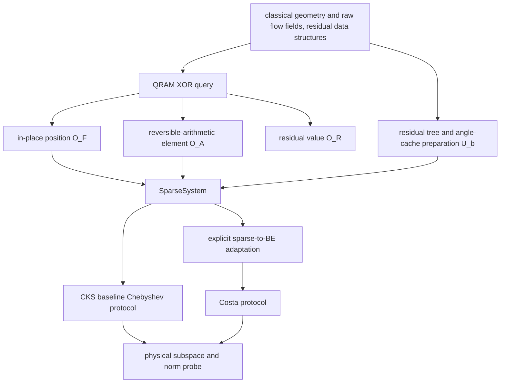

# Replacing the QLSS inside QFVM: a review of input models, QRAM data structures, and output contracts

**English** · <a href="../zh/reference/qfvm-input-models.html">简体中文</a>

Review date: 2026-09-09. This document corresponds to the implementation after this round of fixes; the reviewed baseline is the QFVM path of oracq 0.4.0.

## Conclusions

**The baseline did not correctly implement QLSS replacement across input models.** The original {obj}`roe_qfvm_step <oracq.applications.qfvm.roe_qfvm_step>` first hard-coded a call to {obj}`roe_qfvm_block_encoding <oracq.applications.qfvm.roe_qfvm_block_encoding>` and then executed qlss(be, rhs). That can only replace Python generators accepting the same BE interface. Although the library already had {obj}`SparseAccess <oracq.algorithms.input_model.oracles.SparseAccess>`, it never became the problem input that QFVM exposed to the QLSS.

The sparse input of QFVM/CKS and the BE input of Costa sit at different abstraction layers but are not mutually exclusive. A sparse oracle can be explicitly converted into a BE and handed to Costa; conversely, recovering efficient sparse position and element oracles from an arbitrary BE has no such guarantee in general. **The replacement should happen between the problem and the protocol, with the adaptation kept explicit; distinct input interfaces must not be treated as the same signature.**

This round adjusted the implementation: the same QFVM problem can be handed to the baseline CKS route declaring sparse input, or to the Costa route declaring block_encoding input. They keep the same raw field/geometry/RHS inputs and physical output coordinates; auxiliary qubits and internal modules may differ. The full numerical correctness of the algorithms is not yet certified, so what is established here is replaceability at the level of input adaptation and construction, not that the two solvers are numerically equivalent or both reach the papers' complexity.

## 1. What the three papers actually assume

### QFVM

QFVM's main contribution is constructing the interfaces needed for quantum solving from classical flow-field and geometry data, and handling the readout and local updates of the solution. The interfaces in paper section III are the matrix elements O_A, the residual elements O_b, and the relevant cell positions O_l; section IV then obtains the normalized residual state through a residual sum-of-squares tree. In particular, the **residual value query O_b** must be distinguished from **the operation that prepares |b>**. [QFVM III–IV](https://arxiv.org/html/2102.03557v1#S3)

O_l originally describes adjacency at the cell level; applying it to a scalar matrix of multiple conserved quantities additionally requires component indices. This document's one-dimensional three-component implementation has three neighboring cells and nine structural slots. Entries whose value is zero are allowed inside a slot; this is not the same as mapping different slots to the same address.

The paper does not require upper-layer QFVM to provide a Costa walk first, nor does it give the T_L† S T_R interface that earlier documentation implied. Block encoding belongs to the input-adaptation layer of the chosen QLSS.

### CKS

CKS 1.1 requires two accesses for a Hermitian sparse matrix: the position interface turns the sparse ordinal of a given column **in place** into a row index; the element interface XOR-writes the entry word at arbitrary coordinates. A P_B preparing the normalized |b> is additionally provided. In-place position computation needs a valid inverse mapping; implementing only an order-preserving XOR table lookup does not yet satisfy that interface. [CKS 1.1, equations (1)–(2)](https://arxiv.org/html/1511.02306#S1.SS1)

A non-Hermitian matrix can be extended into a Hermitian system, but this requires row and column sparse access to the original matrix. The walk of CKS 4 further introduces a matrix scaled by sparsity; its walk parameters must not be taken directly as parameters of the original matrix. The baseline Chebyshev/LCU route and the later variable-time amplitude amplification are different implementation scopes. [CKS 4](https://arxiv.org/html/1511.02306#S4)

### Costa

Costa starts from a BE of U_A and the state preparation of U_b, and uses controlled U_A, U_A†, U_b, U_b†. The paper discusses the adaptation from sparse input to a BE, so using QFVM's sparse data does not violate its input model. What must be converted is the interface and its normalization parameters. [Costa input description, IV, and Appendix E](https://arxiv.org/html/2111.08152v1)

The paper's normalized matrix and the library's "BE that records alpha" must not be mixed without conversion. The Hermitian extension of a general matrix and the extra auxiliary structure in the walk also need explicit coordinate conventions.

| item | QFVM provides/builds | CKS consumes | Costa consumes |
|---|---|---|---|
| Geometry and raw flow fields | classically updatable, quantumly queryable data | accessed via position/element oracles | accessed via the sparse→BE adaptation |
| Sparse positions | cell adjacency extended to component positions | in-place position operation and its inverse | not required to receive this interface directly |
| Matrix entries | computed by reversible arithmetic on raw data | entry XOR operation | the corner block of the adapted U_A |
| Right-hand side | residual values, norm tree, preparation circuit | P_B | U_b and its inverse/controlled versions |
| Normalized solution | still needs readout and magnitude recovery | success branch depending on the output algorithm | success branch depending on the output algorithm |

## 2. The four layers that must be kept apart



1. **QRAM resources** provide reversible data queries at arbitrary superposed addresses. They do not automatically provide amplitude encoding.
2. **Classically updatable data structures** organize geometry, raw fields, residuals, and tree nodes; they determine whether the data needed for preparation can be generated efficiently.
3. **Oracle operations** carry concrete register-update contracts, such as in-place permutation, entry XOR, and state preparation with a clean workspace.
4. A **protocol** generates the algorithm and its adapters according to the input model. It is an ordinary Python generator; what remains in RIR are module calls and resource bindings.

The QFVM paper additionally assumes that quantum QRAM queries take logarithmic time and that classical access/single-point overwrites have RAM capability. These are resource-model assumptions, not hardware properties the language automatically proves once QRAMDECL has been written. [QFVM II.3](https://arxiv.org/html/2102.03557v1#S2.SS3)

## 3. Baseline problems and this round's fixes

| baseline problem | impact | handling in this round |
|---|---|---|
| QFVM hard-codes a BE output | a native sparse QLSS cannot plug in directly | added {obj}`LinearSystem <oracq.algorithms.qlss.qlss.LinearSystem>`, {obj}`SparseSystem <oracq.algorithms.qlss.qlss.SparseSystem>`, {obj}`BlockSystem <oracq.algorithms.qlss.qlss.BlockSystem>`, and {obj}`QLSSProtocol <oracq.algorithms.qlss.qlss.QLSSProtocol>` |
| the geometry XOR query was treated as a substitute for sparse position access | no CKS in-place semantics or inverse mapping | added a real O_F; the full permutation is completed by reversible transpositions of the nine positions |
| the Roe entry accepted only source/row/col/band | not an O_A at arbitrary matrix coordinates | added a row/column/data interface returning zero outside the sparse domain |
| padding three components to four left all-zero rows/columns | the extended matrix is wholesale singular | adds a positive diagonal padding_value in the padded subspace |
| alpha and Costa's kappa were independent | the inverse spectral bound of the encoded matrix could be wrong | derives the actual parameter from alpha / sigma_min_lower |
| Costa's RHS zero-state reflection omitted work | the projected object of the general unitary extension was incomplete | reflects the zero states of both target and RHS work |
| only a {obj}`StateOracle <oracq.algorithms.input_model.oracles.StateOracle>` return value | the norm of the QFVM update could not be recovered correctly | {obj}`SolveResult <oracq.algorithms.qlss.qlss.SolveResult>` carries the physical channel and an independent matrix-norm probe |
| angle-tree preparation enumerated all prefixes | the query count grows with the data length | each tree level forms an address from the quantum prefix and queries it |
| local updates copied all states/fluxes | implicit O(N) classical overhead | updates only the affected parts with local staging and in-place commit |

The historical access.sparse_block_encoding remains a candidate description in the old directory and is marked legacy; the new QFVM path does not use it.

## 4. How the new QFVM sparse input is implemented

The implementation is in [qfvm_sparse.py](../api/applications/qfvm.rst).

### The in-place position oracle

The public interface is column, index, and work, where index uses the full matrix index width. The first nine index values map to the nine distinct positions defined by the geometry; the remaining inputs are defined by extension through the full permutation, and the inverse is given by the adjoint of the same circuit.

The implementation queries only the nine structural positions per column and completes the permutation through a transposition sequence; QRAM is not required to store an N×N permutation table. Its cost includes sparsity and reversible comparison/transposition overhead; this round does not advertise it as a free unit-gate operation.

### The element oracle at arbitrary coordinates

The interface is row, column, and data. The circuit uses the structural slots to find the corresponding source cell and component and then calls the automatically compiled Roe mathematical function. No full matrix-entry table is precomputed on the classical side.

Entries outside the structural domain are zero; the diagonal at padded coordinates is padding_value. On arithmetic failure or overflow, the current finite implementation totalizes that entry to zero. Spectral assumptions should therefore apply to the **actually quantized matrix**, not only to the ideal continuous Jacobian. This numerical policy and its physical impact remain to be verified.

### Hermitian extension and the physical channel

Let the original finite matrix be M and the actual right-hand side be r. On the physical coordinates we use

```text
D = [[0, M],
     [M^T, 0]],     b_D = [r, 0].

D^-1 b_D = [0, M^-1 r].
```

The current QFVM numerics are real, so the transpose suffices; general complex values need the conjugate transpose. The empty coordinates produced by padding three components to four additionally carry padding_value·I, and the right-hand side is zero there. This avoids artificially introducing an all-zero eigensubspace. The invertibility of the physical M and the quantized spectral bounds are still declared by the problem side.

This also hands both solver routes the same problem. On return, the physical channel with extension flag 1 is selected uniformly; the final 4N coordinates still contain the empty slots used to represent the 3N physical quantities, and classical readout must interpret them through the coordinate mapping.

## 5. The sparse-to-BE adaptation is not a type conversion

The implementation is in [sparse_models.py](../api/algorithms/input_model/sparse.rst). The current official adaptation specifically supports real Hermitian inputs with a non-negative diagonal; QFVM's extension above satisfies this structure. A general sparse matrix cannot use this adapter merely by setting the same bit widths.

The adapter generates a CKS-style T, then swaps the coordinates on both sides and the failure flags on both sides, forming the self-adjoint unitary extension T†ST. The success amplitude of a non-zero entry uses sqrt(|entry|/amax); negative off-diagonal elements use a signed phase convention. Swapping the failure flags on both sides is an essential part; swapping only the indices does not suffice.

If each row/column enumerates s distinct structural positions and amax truly bounds the entry magnitudes, then the corner block is D/alpha with alpha=s·amax. The current QFVM has s=9. Amplitude transduction at small word lengths has an ordinary gate implementation; beyond 12 bits an explicit to-be-bound transducer is kept, and the cost of that numerical implementation should be counted.

This round checked the corner block and alpha with a 2×2 matrix containing negative off-diagonal elements, and checked that the third power of the walk projects onto T_3(D/alpha). Such witnesses check the signs and normalization of the input adaptation; they do not constitute a proof for all matrices/word lengths.

### Costa's parameter conversion

The library's BE satisfies that the zero-signal corner block is D/alpha. What Costa actually sees is D_hat=D/alpha:

```text
sigma_min(D_hat) >= sigma_min_lower / alpha
encoded_inverse_bound = alpha / sigma_min_lower.
```

This generally differs from cond(D). For example, D=0.5 I has condition number 1, but with alpha=2 the encoded matrix has inverse norm 4. For a non-Hermitian original matrix, singular-value bounds should be used; a ratio of absolute eigenvalues is not a general substitute.

{obj}`SpectralPromise <oracq.algorithms.qlss.qlss.SpectralPromise>` records a norm upper bound, a minimum-singular-value lower bound, and the provenance of the evidence. It is the caller's declaration: the language does not prove it, nor does it introduce eps into the core. The original low-level {obj}`make_costa_qlss <oracq.algorithms.qlss.qlss.make_costa_qlss>`(...)(be,b) remains for old generators, and its kappa now explicitly denotes the inverse spectral bound of the encoded matrix; the new problem-level entry derives that parameter.

## 6. Output replacement also needs a contract

QFVM ultimately updates the classical flow field and needs the direction and norm of M^-1 r. **The success rate of Costa filtering cannot directly reuse the normalization factor of the CKS inverse-operator LCU.** The two form their success branches differently; merely returning the normalized solution state does not complete the replacement.

The new SolveResult provides a state interface with the same physical direction plus an independent norm_probe. Let p_solver be the success probability after solving; applying the matrix BE again on the successful solution, let p_joint be the measured probability that the solve and the new BE signal succeed together. If the output direction is indeed the normalized solution, then

```text
p_joint / p_solver = ||D |x_hat>||^2 / alpha^2
||x|| = ||r|| / [alpha * sqrt(p_joint / p_solver)].
```

This construction uses one normalization contract for both solvers, and the extra query cost is explicitly present. The generated probe is a quantum module; probability estimation/amplitude estimation, phase conventions, tomography of controlled state preparations, and the full CFD outer update remain future work. When the known RHS norm is zero, the new entry refuses to prepare the normalized RHS and requires the classical side to handle the zero update.

## 7. The actual scope of QRAM and quantum data structures

QFVM's input is not a raw array plus the mere label "has QRAM". It needs geometry, raw physical variables, residual values, sum-of-squares norm trees, and synchronization relationships among these data.

The current implementation maintains:

- QRAM of raw fields and geometry;
- a queryable rhs_values and sign bank;
- a classical sum-of-squares norm tree and the root-node norm;
- a rotation-angle cache bank for every internal tree node.

This is one concrete refinement implementing U_b with a classically locally updatable angle cache; it does not claim to reproduce all of the paper's P_R tree-node query circuits as-is. Angles are derived from the sums of squares under RY's half-angle convention: the RY parameter is 2 acos sqrt(S_left/S_node). Residual values are quantized first and then shared by the value bank, the signs, the tree, and the angle cache.

For a vector of length 2^n, the new preparation circuit uses 2n angle-bank queries (including uncomputation) plus sign accesses; the original implementation used 2(2^n−1) queries. If one QRAM query itself takes O(log N) time, the query count and the total query time should be counted separately.

A single-point flow-field modification recomputes only adjacent interfaces and affected tree nodes; whole-field copying has been removed. Initialization and snapshot/backend materialization still have linear cost. PySparQ currently has no native partial QRAM write interface, and changing a bank still requires re-materialization; this must not be counted as the constant-time physical write the paper assumes. After modifying QRAM contents, the IR of the same structure can be reused provided the element bounds, spectral declarations, and RHS/tree caches stay synchronized; changing alpha or the register layout requires regeneration. The QRAM contents must be fixed within each coherent segment of computation, and P, P†, controlled P, and the norm probe must use a consistent data version. [QFVM II.3, IV](https://arxiv.org/html/2102.03557v1#S4)

## 8. How to replace

```python
from oracq import FixedFormat, SpectralPromise
from oracq.applications.qfvm import roe_qfvm_inputs, roe_qfvm_problem, bind_qfvm
from oracq.algorithms.qlss.qlss import CKSConfig, make_cks_qlss
from oracq.algorithms.qlss.qlss import CostaConfig, make_costa_qlss

inputs = roe_qfvm_inputs(fmt=FixedFormat(6, 2), angle_width=6)
problem = roe_qfvm_problem(
    inputs,
    # example declaration; a real problem should provide spectral bounds
    # covering the actual finite matrix.
    spectrum=SpectralPromise(norm_upper=10, sigma_min_lower=0.5),
    amax=4,
    rhs_norm=1.0,
)

cks = make_cks_qlss(CKSConfig(order=2))(problem)
costa = make_costa_qlss(CostaConfig(steps=1))(problem)

cks_rir = bind_qfvm(cks.operation.program(), inputs)
costa_rir = bind_qfvm(costa.operation.program(), inputs)
```

The same problem uses the same data oracles. The CKS protocol consumes a SparseSystem; the Costa protocol requests a BlockSystem, triggering the sparse→BE adaptation. There is no reverse BE→sparse automatic conversion.

In this round's four-cell instance, both routes have alpha=36, an encoded inverse spectral bound of 72, and a physical output width of 4; the CKS and Costa signal widths are 20 and 25 respectively. **After replacing the protocol, the upper-level register layout should be regenerated**; different auxiliary-qubit signatures must not be stuffed into already-closed RIR. Regeneration still preserves module and oracle boundaries and does not require a global expansion.

The original roe_qfvm_step now requires a QLSSProtocol declaring input_model together with spectrum; it no longer infers the input model from a bare callable.

## 9. This round's evidence and what remains unfinished

Reproduction commands:

```bash
PYTHONPATH=src .venv/bin/python tools/build_qlss_comparison.py
.venv/bin/pytest tests/core/test_qlss_input_models.py -q
# use an environment with real pysparq/uniqc installed and a C++ compiler:
PYTHONPATH=src python -m unittest discover -s tests/integration -p test_qfvm_input_models.py -v
```

out/qlss-audit/ stores the open/closed RIR, modular OriginIR, strict-gate-set description, memory snapshot, and norm probe for each of the two routes. The core witnesses include the negative-element BE, the Chebyshev corner block, the alpha parameter conversion, physical-norm recovery on a scalar system, layer-by-layer QRAM queries, and local updates; real PySparQ checked the position oracle's full permutation/inverse and the padding-element XOR on non-zero data. Details are in the [acceptance record](../archive/qfvm-qlss-validation.json).

The baseline CKS implementation is the Chebyshev/LCU route of paper §4; the variable-time VTAA layer of section 5 is implemented separately in `algorithms/vtaa_cks.py` (QSP verdict clock, band-split inverse LCU, Ambainis nested amplification), whose band-polynomial precision and amplification schedule remain prototype declarations and have not entered the QFVM directory. Costa is still the existing general-walk/filtering prototype; its initial walker state, final success channel, and overall solve precision need further verification. The example's order=2 and steps=1 are for illustrating the paradigm and carry no solve-precision promise. There is also no complete quantum tomography, amplitude estimation, or numerical CFD closed loop yet.

The current state can therefore be stated precisely: **QFVM's problem-input and output adaptation now supports switching between different QLSS input models; "seamless equivalent replacement" of the two complete numerical solvers cannot yet be declared done.** This limitation is an explicit algorithm-validation boundary and should no longer be obscured by the fact that Python functions can be swapped.

## 10. Numerical validation record (2026-09-16)

`tests/verification/verify_qham_qfvm.py` performed paper-level numerical validation of the input-model layer covered by this review on real backends (the PySparQ native RIR interpreter and the UniQC state vector; no mocks, no skips). Unlike the structural/contract witnesses of §9, this round's evidence is numerical execution results; the solver-side precision is still uncertified.

**Fixed-point format precondition.** The numerical experiments exposed a usage precondition: the entropy-fix term of {obj}`roe_face <oracq.applications.roe.roe_face>` contains the constant 2δ; if the fixed-point fraction bits truncate it to zero (for example {obj}`FixedFormat <oracq.algorithms.common.arithmetic.FixedFormat>`(4,1) with the default δ=0.125), the entropy-fix branch divides by zero and the matrix entries silently totalize to zero per the convention of §4. The earlier integration witnesses checked only the padding diagonal and did not trigger this path. This round's experiments uniformly use FixedFormat(5,2) with δ=0.5 (2δ, δ², and δ are all exactly representable), confirming concretely one consequence of the requirement that **spectral declarations must target the actually quantized matrix**: under a coarse format the whole Roe matrix can degenerate to the zero matrix.

**Matrix entries and the position oracle.** The compiled Roe circuit's raw outputs agree bit for bit with an independent fixed-point simulation (re-implemented per the toward_zero/modular_wrap documented semantics of fixed_arithmetic) over 32 superposed branches, with the status flags likewise agreeing; the sparse-entry oracle agrees bit for bit under an 8-branch superposition of one structural column, with the zero elements and the padding diagonal (raw=4, i.e. 1.0) in the right positions. The method error of 0.43–0.48 against the float64 Roe formula is the inherent quantization error of the 5-bit fixed-point pipeline, not an implementation defect. Under a superposition of all 32 columns the position oracle yields a full permutation in every column, with 0 mismatches between the 9 structural slot mappings and the independent geometry semantics, and the workspace uncomputed.

**RHS preparation.** The residual-state amplitudes agree with an independent residual computation (error 1.11e-16), and the signs are written exactly via Z kickback; the angle-cache bank and the sign bank agree pointwise with an independently rebuilt sum-of-squares norm tree. This supports the angle-cache preparation construction of §7, but the effect of angle quantization on success rates/readout amplitudes is not yet quantitatively certified.

**Classical data structures.** F*(L,R)=left·U_L+right·U_R differs from flow_data's matrix-inversion implementation by 3.33e-16; flux consistency F*(U,U)=F(U) is 2.22e-16; the matrix identity M·u−mass·u=−residual (matrix-encoded mass term minus the residual flux difference, the standard sign convention of implicit FVM) has residual 2.22e-16; a single-point flow-field update agrees bank by bank with a full recomputation and recomputes only adjacent interfaces and affected tree nodes (the locality claim of §7).

**Not yet certified.** The end-to-end numerical precision of both QLSS routes, the norm probe's probability estimation, the effect of angle quantization on the solution, and the outer CFD loop remain outside the validated scope. Full metrics are in `out/verification/qham_qfvm.json`; to reproduce: `PYTHONPATH=src <interpreter with pysparq+uniqc> tests/verification/verify_qham_qfvm.py`.
